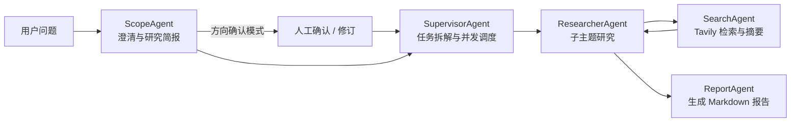

# Deep Research 深度研究

基于 FastAPI、AgentScope 2.x 和 React 的多智能体深度研究平台。系统覆盖需求澄清、研究方向确认、并行资料检索、网页摘要和 Markdown 报告生成，并通过 SSE 实时展示执行过程。


## 技术栈

- 后端：Python 3.11、FastAPI、Uvicorn、AgentScope 2.x
- 数据：MySQL、SQLAlchemy Async、Redis
- 前端：React、TypeScript、Vite、Tailwind CSS
- 搜索：Tavily Search
- 可观测性：OpenTelemetry、OTLP、Langfuse
- 测试：Pytest、真实 SSE smoke、真实 Mimo 工作流 smoke

## 项目结构

```text
deep-research-main/
├── backend-python/          # 当前后端
│   ├── app/
│   │   ├── api/             # REST/SSE 路由
│   │   ├── application/     # Agent、工作流、服务与工具
│   │   ├── core/            # 配置、认证、错误与通用工具
│   │   ├── domain/          # ORM、DTO、状态与运行时契约
│   │   └── infrastructure/  # DB、Redis、LLM、搜索与可观测性
│   └── tests/
├── frontend/                # React 前端
├── docs/                    # Python 当前实现文档
└── openspec/                # OpenSpec 配置
```

## 工作流



研究任务使用有界异步队列执行。`MEDIUM`、`HIGH`、`ULTRA` 预算分别限制子研究数、搜索次数、并发数和单次结果数。

## 快速开始

前置依赖：Conda、MySQL 8.0+、Redis 6.0+。默认数据库为 `db_deep_research`，本地 MySQL 账号为 `root`，密码为 `12345678`。

```bash
conda env create -f backend-python/environment.yml
cp backend-python/.env.example backend-python/.env

cd backend-python
./start-python-backend.sh
```

另开终端启动前端：

```bash
cd frontend
npm install
npm run dev
```

- 后端：`http://127.0.0.1:8080`
- 健康检查：`http://127.0.0.1:8080/health`
- Scalar API 文档：`http://127.0.0.1:8080/scalar/index.html`
- OpenAPI：`http://127.0.0.1:8080/v3/api-docs`

模型配置从 MySQL `model` 表读取，完整链路测试默认查找数据库中的 `mimo` 模型。

## 测试

```bash
cd backend-python
conda run -n deep-research-py python -m compileall -q app tests
conda run -n deep-research-py pytest -q
PYTHONUNBUFFERED=1 conda run -n deep-research-py python tests/sse_smoke.py
PYTHONUNBUFFERED=1 conda run -n deep-research-py python tests/live_workflow_smoke.py

cd ../frontend
npm run build
```

## 文档

- [后端开发与配置](backend-python/README.md)
- [架构设计](docs/架构设计.md)
- [API 与数据契约](docs/API与数据契约.md)
- [性能与可观测性](docs/性能与可观测性.md)
- [HITL 方向确认](docs/hitl.md)

