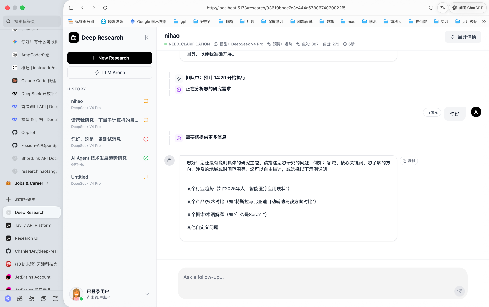
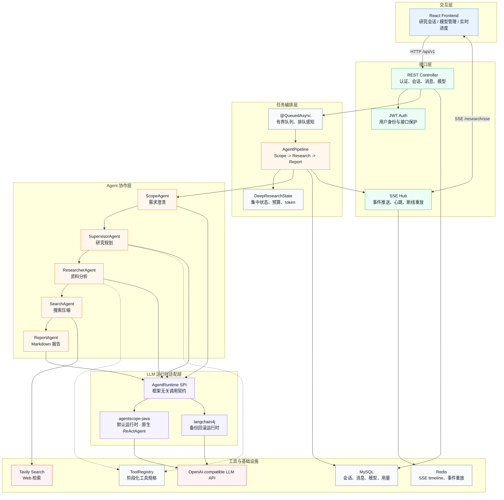
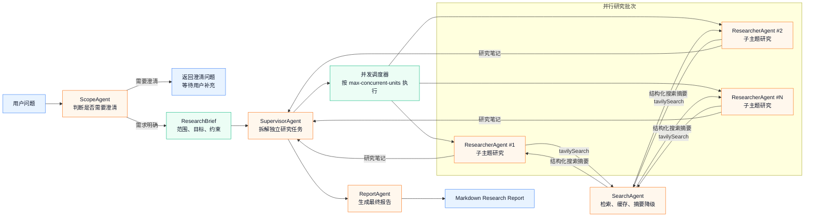

# Deep Research 深度研究

> 基于多智能体协作的自动化深度研究平台



## 简介

Deep Research 整合 LLM 推理、Web 搜索与报告生成，实现从选题澄清、资料收集到成果撰写的全流程自动化。

## 核心架构

Deep Research 采用 Spring Boot 后端 + React 前端 + 多 Agent Pipeline 的分层架构。前端通过 REST API 发起研究任务，通过 SSE 订阅长任务进度；后端用有界异步队列承接请求，并在 Agent Pipeline 内完成范围澄清、并发分工研究、搜索压缩和报告生成。



### 智能体工作流

三阶段流水线，每个阶段只负责一个清晰目标，通过统一的 `DeepResearchState` 传递上下文、预算、工具调用次数和 token 用量。



> 详细架构说明见 [doc/intro/核心架构.md](doc/intro/核心架构.md)

## 技术亮点

- **AgentScope v2 原生 ReActAgent 驱动** — 使用 `ReActAgent` + `Toolkit` 接管完整的推理-行动循环，而非仅替换聊天模型
- **框架无关工具注册中心** — 自定义 `@ResearchTool` 注解 + `ToolRegistry`，按阶段分组，运行时适配
- **可切换 Agent Runtime** — `agentscope-java`（默认）/ `langchain4j`（备份），通过环境变量一键切换
- **代码层并行研究调度** — Supervisor 先生成独立子任务，再由 Java 按 `max-concurrent-units` 并发执行 Researcher，避免依赖模型主动并行 tool call
- **搜索性能优化** — Tavily 查询缓存、URL 级网页摘要缓存、摘要输入截断和短超时降级，减少重复 API 调用和长尾等待
- **OpenTelemetry + Langfuse 可观测链路** — 三层 span 层级（workflow → stage → agent/model/tool），自定义 `FixedOtelTracingMiddleware` 修复 Reactor 异步上下文传播
- **中心化研究状态** — `DeepResearchState` 贯穿全阶段，集中管理范围、预算、token、笔记
- **Budget 预算机制** — MEDIUM/HIGH/ULTRA 三级，控制子研究数、搜索次数、并发数和单次搜索结果数
- **有界异步任务队列** — `@QueuedAsync` + 有界线程池，防止任务堆积
- **SSE 实时推送 + Redis 断线重放** — 事件按序列号缓存，重连不丢失
- **幂等状态机** — CAS 更新防止重复启动研究

> 完整技术亮点说明见 [doc/intro/技术亮点.md](doc/intro/技术亮点.md)

## 快速开始

**环境要求**：Java 21、Maven 3.8+、MySQL 8.0+、Redis 6.0+

```bash
# 克隆项目
git clone https://github.com/haotangyuan/deep-research.git
cd deep-research

# 配置环境变量
cp .env.example .env && vim .env

# 使用启动脚本（自动检查环境、创建数据库、编译启动）
./start.sh
```

或手动构建：

```bash
mvn clean package -DskipTests
java -jar target/researcher-0.0.1-SNAPSHOT.jar
```

或 Docker：

```bash
docker compose up -d
```

后端 API 启动于 `http://localhost:8080`

- **API 文档 (Scalar)**: http://localhost:8080/scalar/index.html
- **OpenAPI 规范**: http://localhost:8080/v3/api-docs

### 环境变量

编辑 `.env` 文件，参考 `.env.example` 配置数据库、Redis、Tavily、JWT、LLM 框架和可观测链路参数。

常用性能参数：

| 变量 | 默认值 | 说明 |
|------|------:|------|
| `RESEARCH_SEARCH_MAX_RESULTS_PER_QUERY` | `3` | 单次 Tavily 搜索最多保留的结果数 |
| `RESEARCH_SEARCH_SUMMARY_TIMEOUT_SECONDS` | `60` | 单个网页摘要的短超时时间，超时后降级使用原始摘要 |
| `RESEARCH_SEARCH_SUMMARY_RAW_CONTENT_MAX_CHARS` | `12000` | 送入 LLM 摘要的网页内容最大字符数 |
| `RESEARCH_SEARCH_SUMMARY_CACHE_ENABLED` | `true` | 是否启用 URL + 内容级网页摘要缓存 |
| `TAVILY_CACHE_ENABLED` | `true` | 是否启用 Tavily 查询缓存 |

### Agent 运行时选择

| 值 | 说明 |
|----|------|
| `agentscope-java` | 默认，使用 AgentScope v2 原生 `ReActAgent` + `Toolkit` |
| `langchain4j` | 备份，使用 langchain4j 1.8.0 OpenAI-compatible 模型 |

```bash
RESEARCH_AGENT_FRAMEWORK=langchain4j java -jar target/researcher-0.0.1-SNAPSHOT.jar
```

### 可观测链路配置

```properties
RESEARCH_OBSERVABILITY_ENABLED=true
RESEARCH_OBSERVABILITY_PROVIDER=langfuse
LANGFUSE_PUBLIC_KEY=pk-lf-xxxxx
LANGFUSE_SECRET_KEY=sk-lf-xxxxx
```

支持 Langfuse（OTLP HTTP）和通用 OTLP 后端（Jaeger 等）。详见 [doc/intro/技术亮点.md](doc/intro/技术亮点.md) 第 4 节。

### 前端部署

```bash
cd frontend
npm install && npm run dev
```

访问 `http://localhost:5173`

## API 接口

> 完整接口文档见 [doc/intro/API接口文档.md](doc/intro/API接口文档.md) 或启动后访问 Scalar UI

### 核心流程

```
1. POST /api/v1/research/create?num=1        → 创建研究会话
2. POST /api/v1/research/{id}/messages        → 发送研究问题
3. GET  /api/v1/research/sse?researchId={id}  → SSE 订阅进度
4. GET  /api/v1/research/{id}                 → 查询状态
5. GET  /api/v1/research/{id}/messages        → 获取结果
```

### 接口列表

| 方法 | 路径 | 说明 |
|------|------|------|
| POST | `/api/v1/user/register` | 用户注册 |
| POST | `/api/v1/user/login` | 用户登录 |
| GET | `/api/v1/user/me` | 获取当前用户 |
| GET | `/api/v1/research/create` | 创建研究会话 |
| GET | `/api/v1/research/list` | 研究列表 |
| GET | `/api/v1/research/{id}` | 研究状态 |
| GET | `/api/v1/research/{id}/messages` | 消息和事件 |
| POST | `/api/v1/research/{id}/messages` | 发送消息 |
| GET | `/api/v1/research/sse` | SSE 事件流 |
| GET | `/api/v1/models` | 模型列表 |
| POST | `/api/v1/models` | 添加模型 |
| DELETE | `/api/v1/models/{id}` | 删除模型 |

## 文档目录

| 文档 | 说明 |
|------|------|
| [核心架构](doc/intro/核心架构.md) | 分层架构、Agent 工作流、关键类职责 |
| [技术亮点](doc/intro/技术亮点.md) | AgentScope 原生集成、可观测链路、预算机制等 |
| [API 接口文档](doc/intro/API接口文档.md) | REST API 详细说明、SSE 事件类型 |
| [开发者准则](doc/rules/开发者准则.md) | 分支管理、文档同步、提交规范等 |
| [未来计划](doc/plan/未来计划.md) | Dynamic Workflow、工具扩展、可恢复执行等 |
| [开发记录](doc/dev/) | 每次开发的变更记录 |

## 项目结构

```
src/main/java/dev/haotangyuan/researcher/
├── application/              # 应用层
│   ├── agent/                # 智能体实现 + runtime 适配器
│   │   └── agentscope/       # 原生 ReActAgent、Toolkit、OTel 中间件
│   ├── tool/                 # 工具注册中心 + 注解
│   ├── state/                # DeepResearchState
│   └── workflow/             # AgentPipeline
├── domain/                   # 领域层（实体、MyBatis Mapper）
├── infra/                    # 基础设施层
│   ├── async/                # @QueuedAsync
│   ├── sse/                  # SseHub
│   ├── client/               # TavilyClient
│   └── observability/        # OTel + Langfuse
└── interfaces/               # 接口层（Controller、Service）
```
