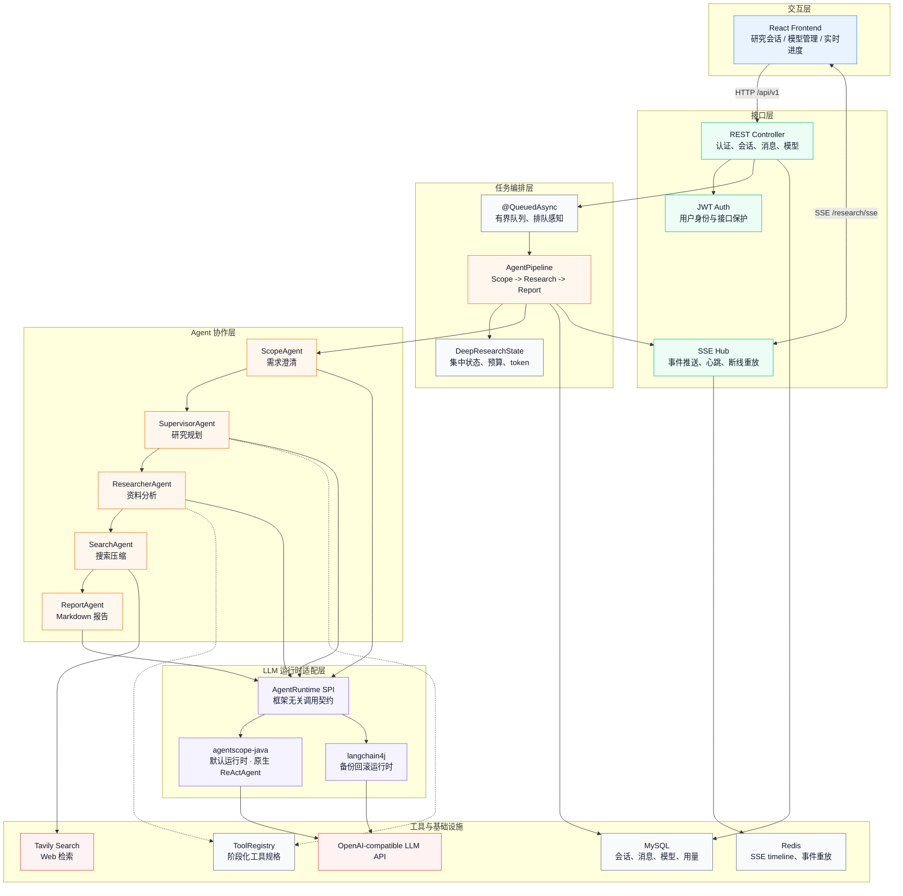
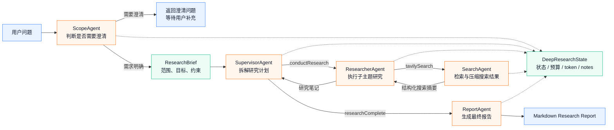
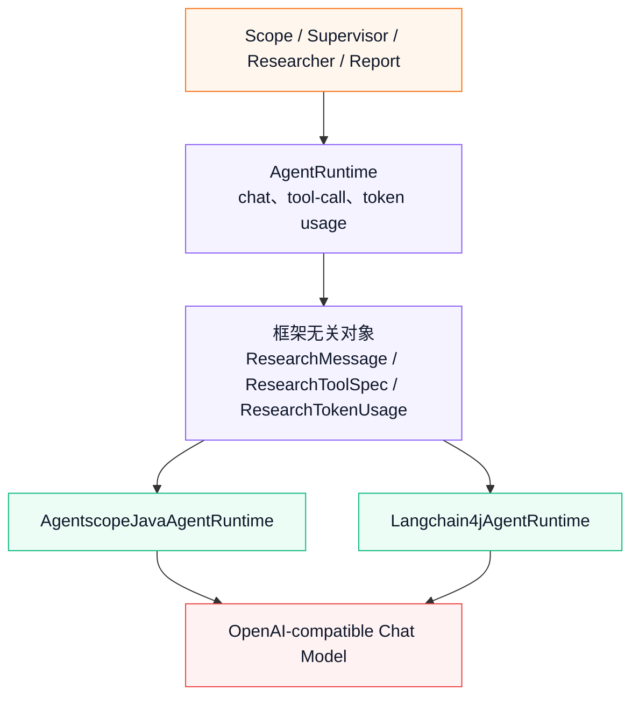
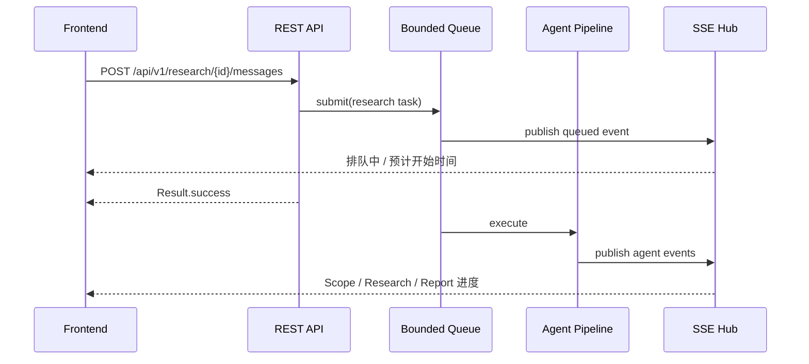
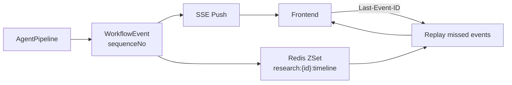
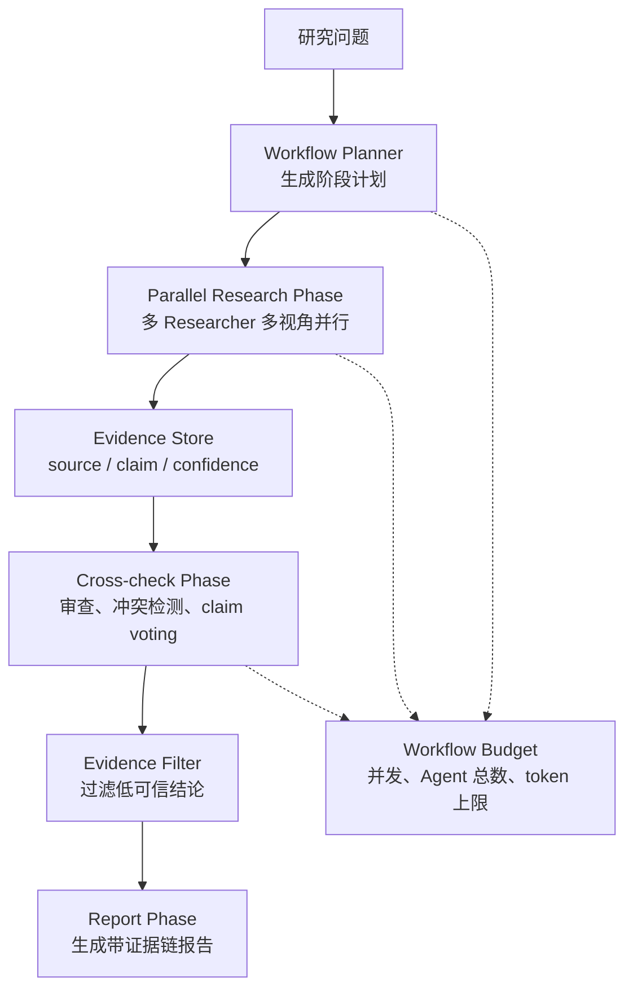

# Deep Research 深度研究

> 基于多智能体协作的自动化深度研究平台


## 简介

Deep Research 整合 LLM 推理、Web 搜索与报告生成，实现从选题澄清、资料收集到成果撰写的全流程自动化。

## 核心架构

Deep Research 采用 Spring Boot 后端 + React 前端 + 多 Agent Pipeline 的分层架构。前端通过 REST API 发起研究任务，通过 SSE 订阅长任务进度；后端用有界异步队列承接请求，并在 Agent Pipeline 内完成范围澄清、分工研究、搜索压缩和报告生成。



### 智能体工作流

系统当前使用稳定可控的三阶段流水线，而不是把所有步骤交给单个 Agent 自由循环。每个阶段只负责一个清晰目标，并通过统一的 `DeepResearchState` 传递上下文、预算、工具调用次数和 token 用量。



### 运行时切换

Agent 层不直接绑定某个 LLM 框架，而是依赖项目自有的 `AgentRuntime` 契约。默认使用 `agentscope-java`，同时保留 `langchain4j` 作为备份运行时，便于对比、回滚和逐步演进。



## 技术亮点

### 1. AgentScope v2 原生 ReActAgent 驱动

默认 `agentscope-java` 运行时使用 AgentScope Java v2 的 `ReActAgent` 接管完整的推理-行动循环，而非仅替换聊天模型调用。这是本项目与简单"换 SDK"最本质的区别。

**实现机制：**

每个 Agent 阶段（Supervisor、Researcher、Scope、Report）都通过 `AgentscopeJavaChatClient.runAgent()` 创建一个独立的 `ReActAgent` 实例：

```
AgentscopeJavaChatClient.runAgent()
  ├── UsageCollectingModel       // 装饰器，跨迭代累计 token
  ├── AgentscopeToolkitAdapter   // 将项目工具转为 AgentScope Toolkit
  ├── AgentscopeStageAgentFactory // 构建 ReActAgent
  │     ├── name / sysPrompt / model / toolkit
  │     ├── FixedOtelTracingMiddleware    // OTel span 创建
  │     └── AgentscopeTraceContextMiddleware // span 属性注入
  └── agent.streamEvents()       // 驱动原生 agent 循环
```

`ReActAgent` 内部自主完成：模型调用 → 解析 tool_calls → 执行 Toolkit → 将结果回填消息列表 → 再次调用模型，直到模型不再调用工具或达到 `maxIterations`。项目不再需要自己编写 ReAct 循环代码。

**与 langchain4j 运行时的关键差异：**

| 维度 | agentscope-java（默认） | langchain4j（备份） |
|------|----------------------|-------------------|
| Agent 循环 | `ReActAgent` 原生管理，`streamEvents()` 驱动 | 项目自建循环，每次调用 `chatModel.chat()` |
| 工具注册 | `Toolkit` + `AgentTool` 接口，`callAsync()` 异步执行 | `ToolSpecification` + 同步 `execute()` |
| 中间件 | `MiddlewareBase` 拦截 agent/model/acting 生命周期 | 无原生中间件，观测逻辑在业务层 |
| 消息格式 | `Msg` + `ContentBlock`（TextBlock / ToolUseBlock / ToolResultBlock） | `ChatMessage` 平铺列表 |
| Token 收集 | `UsageCollectingModel` 装饰器，跨迭代累计 | 单次 `chat()` 返回 |
| 响应流 | `Flux<AgentEvent>` 响应式事件流 | 同步阻塞返回 |

### 2. 框架无关工具注册中心

不同阶段的 Agent 拥有不同工具集。项目不再直接依赖某个框架的工具注解作为核心模型，而是使用自定义 `@ResearchTool` 和 `@ResearchToolParam` 描述工具，再由 runtime adapter 转换为目标框架需要的 tool schema。

```java
@SupervisorTool
public class ConductResearchTool {
    @ResearchTool(name = "conductResearch", description = "...")
    public String conductResearch(
        @ResearchToolParam(name = "researchTopic", description = "...", required = true)
        String researchTopic
    ) { }
}
```

`ToolRegistry` 在启动时扫描阶段注解，生成 `ResearchToolSpec` 并按阶段分组。Supervisor 阶段只能看到 `conductResearch`、`researchComplete`、`think` 等规划工具；Researcher 阶段只能看到搜索和思考工具，减少误调用。

对于 agentscope-java 运行时，`AgentscopeToolkitAdapter` 将 `ResearchToolSpec` 转换为 AgentScope `Toolkit`，每个工具包装为 `AgentscopeToolBinding`，在 `callAsync()` 中执行实际逻辑并创建 OTel span。

### 3. 可切换 Agent Runtime

Agent 业务逻辑与具体 LLM 框架解耦。`ScopeAgent`、`SupervisorAgent`、`ResearcherAgent`、`ReportAgent` 只依赖 `AgentRuntime`，不直接构造 langchain4j 或 agentscope-java 对象。

```yaml
research:
  agent:
    framework: ${RESEARCH_AGENT_FRAMEWORK:agentscope-java}
```

如需回滚到 langchain4j：

```bash
RESEARCH_AGENT_FRAMEWORK=langchain4j java -jar target/researcher-0.0.1-SNAPSHOT.jar
```

### 4. 基于 OpenTelemetry + Langfuse 的可观测链路

项目通过 OpenTelemetry 标准协议将 Agent 执行链路导出到 Langfuse，实现对多 Agent 嵌套调用的完整可观测性。

**架构设计：**

可观测链路分为三层，各层职责明确：

```
ResearchObservation（项目层）
  ├── deep_research.workflow    // 根 span，贯穿整个研究任务
  └── deep_research.stage *    // 每个 Agent 阶段的 span
        │
FixedOtelTracingMiddleware（AgentScope 中间件层）
  ├── invoke_agent <name>      // Agent 执行 span
  └── chat <model>             // 模型调用 span，含 token 用量
        │
AgentscopeToolkitAdapter（工具层）
  └── execute_tool <name>      // 工具调用 span，含调用参数和结果
```

**核心实现 — `FixedOtelTracingMiddleware`：**

AgentScope v2 内置的 `OtelTracingMiddleware` 存在一个关键问题：当 Agent 执行跨越 Reactor 异步边界（如 `Flux` 操作符、线程调度）时，OTel 的线程本地上下文会丢失，导致子 span 变成孤立根 span，无法正确嵌套在父 span 下。

`FixedOtelTracingMiddleware` 通过以下机制修复此问题：

1. **Reactor Context 传播**：在 `Flux.deferContextual()` 中读取 OTel 上下文，创建新 span 后通过 `.contextWrite()` 将新上下文写入 Reactor Context 链，确保下游操作符能看到正确的父 span。
2. **线程本地栈**：使用 `ThreadLocal<Deque<Context>>` 维护上下文栈，支持嵌套 span 的正确压栈和弹栈。
3. **显式父上下文**：每个 span 创建时通过 `.setParent(parentContext)` 显式指定父上下文，而非依赖 `Context.current()` 的隐式线程本地查找。

**Langfuse 中的 span 层级示例：**

```
deep_research.workflow
├── deep_research.stage ScopeAgent
│   └── invoke_agent ScopeAgent
│       └── chat mimo-v2.5-pro
├── deep_research.stage SupervisorAgent
│   └── invoke_agent SupervisorAgent
│       ├── chat mimo-v2.5-pro
│       ├── execute_tool thinkTool
│       └── execute_tool conductResearch
│           └── invoke_agent ResearcherAgent
│               ├── chat mimo-v2.5-pro
│               ├── execute_tool tavilySearch
│               │   └── invoke_agent SearchAgent
│               │       └── chat mimo-v2.5-pro
│               └── execute_tool thinkTool
└── deep_research.stage ReportAgent
    └── invoke_agent ReportAgent
        └── chat mimo-v2.5-pro
```

**配置方式：**

```properties
# 开启可观测链路
RESEARCH_OBSERVABILITY_ENABLED=true
RESEARCH_OBSERVABILITY_PROVIDER=langfuse

# Langfuse OTLP 认证（https://cloud.langfuse.com 获取）
LANGFUSE_PUBLIC_KEY=pk-lf-xxxxx
LANGFUSE_SECRET_KEY=sk-lf-xxxxx
LANGFUSE_INGESTION_VERSION=4

# 可选：捕获 prompt 和响应摘要到 span（默认关闭）
RESEARCH_OBSERVABILITY_CAPTURE_IO=false
RESEARCH_OBSERVABILITY_IO_MAX_CHARS=500
```

自托管 Langfuse 时，将 endpoint 替换为自托管实例的 OTLP traces 地址：

```properties
RESEARCH_OBSERVABILITY_ENDPOINT=https://your-langfuse-instance.com/api/public/otel/v1/traces
```

也支持通用 OTLP 后端（如 Jaeger）：

```properties
RESEARCH_OBSERVABILITY_ENABLED=true
RESEARCH_OBSERVABILITY_PROVIDER=otlp
RESEARCH_OBSERVABILITY_ENDPOINT=http://localhost:4318/v1/traces
```

**为什么没有使用 AgentScope Studio：**

AgentScope 提供了自有的 Studio 可视化工具，但本项目选择通过 OTel 标准协议对接 Langfuse，原因如下：

- **依赖兼容性**：当前使用的 `agentscope-core:2.0.0-RC1` 不包含 Studio 集成类，Studio 功能需要额外依赖或更高版本。项目通过反射尝试加载 `StudioManager`，如果类不存在则优雅降级并记录 warning。
- **标准协议优势**：OTel 是云原生可观测性的事实标准，通过 OTLP HTTP 协议可以对接 Langfuse、Jaeger、Grafana Tempo 等任意外观平台，不被单一供应商锁定。
- **多 Agent 嵌套支持**：Langfuse 原生支持 span 的父子层级展示，能清晰呈现 Supervisor → Researcher → Search 三级嵌套调用链，这对调试复杂的多 Agent 工作流至关重要。
- **生产就绪**：Langfuse 提供用户/会话/模型维度的聚合分析、成本统计和 prompt 管理，更适合生产环境的持续观测需求。

如需启用 Studio（需要 AgentScope 版本包含 Studio 类）：

```properties
AGENTSCOPE_STUDIO_ENABLED=true
AGENTSCOPE_STUDIO_URL=http://localhost:3000
AGENTSCOPE_STUDIO_PROJECT=DeepResearch
```

### 5. 中心化研究状态

`DeepResearchState` 是一次研究任务的上下文载体，贯穿 Scope、Research、Report 三个阶段。它集中保存研究范围、阶段状态、预算计数、研究笔记、token 用量和输出内容，避免每个 Agent 分散维护不可追踪的局部上下文。

这种设计让后端可以在任意阶段落库、推送 SSE、做预算判断或失败恢复，也让测试可以围绕状态变化做稳定断言。

### 6. Budget 预算机制

LLM Agent 容易因为工具循环或搜索发散导致成本失控。项目提供 MEDIUM、HIGH、ULTRA 三级预算，通过配置控制子研究数量、搜索次数和并发研究单元。

```yaml
research:
  budget:
    levels:
      MEDIUM:
        max-conduct-count: 2
        max-search-count: 2
        max-concurrent-units: 1
      HIGH:
        max-conduct-count: 4
        max-search-count: 3
        max-concurrent-units: 2
      ULTRA:
        max-conduct-count: 6
        max-search-count: 4
        max-concurrent-units: 3
```

工具执行前会检查计数。达到限制后，工具返回明确提示，引导 Agent 收敛并完成任务，而不是继续尝试调用外部搜索。

### 7. 有界异步任务队列

研究任务耗时较长，不能阻塞 HTTP 请求线程。项目使用自定义 `@QueuedAsync` 将研究执行提交到有界线程池，并根据队列深度估算等待时间，通过 SSE 告知用户任务已排队。



相比直接使用默认 `@Async`，有界队列能防止高并发下任务无限堆积，也让前端获得更明确的等待反馈。

### 8. SSE 实时推送与断线重连

研究过程会产生排队、范围判断、工具调用、搜索摘要、报告生成等事件。`SseHub` 负责把这些事件实时推送给前端，并将事件按递增序列号缓存到 Redis ZSet。



客户端重连时携带 `Last-Event-ID`，后端从 Redis 查询该序列号之后的事件并重放，避免刷新页面或网络抖动导致研究过程丢失。

### 9. 幂等启动与状态机保护

用户可能重复点击发送，浏览器也可能重试请求。后端通过数据库 CAS 更新限制研究任务只能从 `NEW` 或 `NEED_CLARIFICATION` 进入队列：

```sql
UPDATE research_session
SET status = 'QUEUE', update_time = NOW()
WHERE id = #{researchId}
  AND user_id = #{userId}
  AND status IN ('NEW', 'NEED_CLARIFICATION')
```

如果影响行数为 0，说明任务已经启动或处于不可重复启动状态，后端会拒绝重复执行。这避免同一个研究会话产生多条并发 pipeline。

### 10. Token 统计与成本核算

每次 LLM 调用都会返回统一的 `ResearchTokenUsage`，写入 `DeepResearchState` 后在研究完成时持久化到数据库。对于 agentscope-java 运行时，`UsageCollectingModel` 装饰器会在 `ReActAgent` 的每次模型调用后累计 token，确保嵌套的多轮 tool-use 循环不会遗漏用量统计。

```java
ResearchTokenUsage usage = chatResponse.tokenUsage();
state.setTotalInputTokens(state.getTotalInputTokens() + usage.inputTokenCount());
state.setTotalOutputTokens(state.getTotalOutputTokens() + usage.outputTokenCount());
```

### 11. 面向 Dynamic Workflow 的未来演进

当前系统采用固定三阶段 Agent Pipeline，优点是稳定、易观测、易测试。后续可以参考 Claude Code Dynamic Workflows，把"Agent 编排"从固定代码流程升级为可配置、可复用、可恢复的动态工作流。



可演进方向包括：

- **脚本化编排**：将 Scope、Research、Review、Report 表达为 workflow plan，支持保存、复用和参数化运行。
- **多视角 fan-out**：按政策、技术、市场、风险等视角并行启动 Researcher，提升覆盖面。
- **交叉审查**：引入 ReviewerAgent，对 claim 做来源覆盖、冲突检测和可信度评分。
- **证据优先报告**：把搜索结果沉淀为结构化 evidence，再由报告阶段引用已验证证据。
- **可恢复执行**：以 phase run 和 agent run 为单位持久化进度，支持暂停、恢复、失败重试和局部重跑。
- **工作流级预算**：在现有 Budget 基础上增加最大并发 Agent、最大 Agent 总数、每阶段 token 上限和工具调用上限。

## 快速开始

### 方式一：使用启动脚本（推荐）

**环境要求**：Java 21、Maven 3.8+、MySQL 8.0+、Redis 6.0+

```bash
# 克隆项目
git clone https://github.com/haotangyuan/deep-research.git
cd deep-research

# 配置环境变量（参考下方"环境变量配置"）
cp .env.example .env && vim .env

# 使用启动脚本（自动检查环境、创建数据库、编译启动）
./start.sh
```

启动脚本会自动：
- 检查 Java 21 和 Maven 版本
- 验证 MySQL 和 Redis 连接
- 创建数据库和表结构
- 编译项目并启动应用

### 方式二：Docker 部署

```bash
# 拉取镜像
docker pull ghcr.io/haotangyuan/deep-research:latest

# 准备环境变量文件（参考下方"环境变量配置"）
cp .env.example .env && nano .env

# 启动容器
docker run -d -p 8080:8080 --env-file .env --name deep-research ghcr.io/haotangyuan/deep-research:latest
```

```bash
docker compose up -d
```

### 方式三：手动构建

**环境要求**：Java 21、Maven 3.8+、MySQL 8.0+、Redis 6.0+

```bash
# 克隆项目
git clone https://github.com/haotangyuan/deep-research.git
cd deep-research

# 配置环境变量（参考下方"环境变量配置"）
cp .env.example .env && vim .env

# 初始化数据库
mysql -u root -p -e "CREATE DATABASE db_deep_research"
mysql -u root -p db_deep_research < src/main/resources/data.sql

# 编译并启动
mvn clean package -DskipTests
java -jar target/researcher-0.0.1-SNAPSHOT.jar
```

后端 API 启动于 `http://localhost:8080`

- **API 文档 (Scalar)**: http://localhost:8080/scalar/index.html
- **OpenAPI 规范**: http://localhost:8080/v3/api-docs

### 环境变量配置

编辑 `.env` 文件，配置以下参数：

```properties
# 数据库连接
DB_URL=jdbc:mysql://127.0.0.1:3306/db_deep_research?useUnicode=true&characterEncoding=utf8&serverTimezone=Asia/Shanghai
DB_USERNAME=your_username
DB_PASSWORD=your_password

# Redis
REDIS_HOST=127.0.0.1
REDIS_PORT=6379
REDIS_PASSWORD=

# Tavily 搜索 API（https://tavily.com 获取）
TAVILY_API_KEY=tvly-xxxxx
TAVILY_BASE_URL=https://api.tavily.com

# JWT 签名密钥（至少 32 字符）
JWT_SECRET=your-secret-key-at-least-32-characters

# 时区
APP_TIME_ZONE=Asia/Shanghai

# LLM 调用
RESEARCH_AGENT_FRAMEWORK=agentscope-java
LLM_TIMEOUT=120
LLM_LOG_REQUESTS=false
LLM_LOG_RESPONSES=false

# 可观测链路（默认关闭）
RESEARCH_OBSERVABILITY_ENABLED=false
RESEARCH_OBSERVABILITY_PROVIDER=none
RESEARCH_OBSERVABILITY_ENDPOINT=
RESEARCH_OBSERVABILITY_CAPTURE_IO=false
RESEARCH_OBSERVABILITY_IO_MAX_CHARS=500
LANGFUSE_PUBLIC_KEY=
LANGFUSE_SECRET_KEY=
LANGFUSE_INGESTION_VERSION=4
AGENTSCOPE_STUDIO_ENABLED=false
AGENTSCOPE_STUDIO_URL=http://localhost:3000
AGENTSCOPE_STUDIO_PROJECT=DeepResearch
```

### Agent 运行时选择与回滚

项目当前支持两个 Agent LLM 运行时，REST API、SSE 事件、数据库结构和前端交互保持一致：

| 值 | 说明 |
|----|------|
| `agentscope-java` | 默认运行时，使用 `io.agentscope:agentscope-core:2.0.0-RC1` 的原生 `ReActAgent` + `Toolkit` 执行 agent 循环 |
| `langchain4j` | 备份运行时，保留 langchain4j 1.8.0 的 OpenAI-compatible 模型创建与 tool-call 适配 |

默认配置：

```properties
RESEARCH_AGENT_FRAMEWORK=agentscope-java
```

如需回滚到 langchain4j，设置后重启后端即可：

```bash
RESEARCH_AGENT_FRAMEWORK=langchain4j java -jar target/researcher-0.0.1-SNAPSHOT.jar
```

迁移验证覆盖两类场景：

- 单元/契约测试：验证 `agentscope-java` 与 `langchain4j` runtime selection、AgentScope message/toolkit adapter、native ReActAgent tool loop、系统提示合并、token usage 聚合、JSON 输出提取。
- 真实闭环 smoke：使用 MySQL 中已有 OpenAI-compatible 模型配置和 Tavily 配置，通过 REST API 发起研究，验证事件链路可从 `Scope -> Supervisor -> Researcher -> Search -> Report` 到达 `COMPLETED`，并正常累计 token。

可选 live 验证测试默认跳过；需要真实调用模型时设置：

```bash
DEEP_RESEARCH_LIVE_LLM_TESTS=true \
DEEP_RESEARCH_LIVE_BASE_URL=https://your-openai-compatible-endpoint/v1 \
DEEP_RESEARCH_LIVE_API_KEY=your-api-key \
DEEP_RESEARCH_LIVE_MODEL=your-model \
./mvnw -Dtest=RuntimeLiveIntegrationTest test
```

### Agent 可观测链路

项目支持基于 OpenTelemetry 的 Agent 执行链路追踪，通过 OTLP HTTP 协议导出到 Langfuse 或任意兼容后端。

#### 工作原理

`agentscope-java` 运行时在每个 `ReActAgent` 上挂载自定义 `FixedOtelTracingMiddleware`，拦截 agent/model/tool 生命周期事件并创建对应的 OTel span。项目自有 span（workflow、stage）由 `ResearchObservation` 创建，模型调用和工具调用 span 由中间件和 `AgentscopeToolkitAdapter` 创建。所有 span 通过 `research.id` 关联到同一次研究任务。

#### Langfuse 配置

Langfuse 支持 OTLP HTTP ingestion。配置 public/secret key 后，后端会生成 Basic Auth header，并附带 `x-langfuse-ingestion-version=4`：

```properties
RESEARCH_OBSERVABILITY_ENABLED=true
RESEARCH_OBSERVABILITY_PROVIDER=langfuse
RESEARCH_OBSERVABILITY_ENDPOINT=https://cloud.langfuse.com/api/public/otel/v1/traces
LANGFUSE_PUBLIC_KEY=pk-lf-xxxxx
LANGFUSE_SECRET_KEY=sk-lf-xxxxx
LANGFUSE_INGESTION_VERSION=4
```

自托管 Langfuse 时，把 `RESEARCH_OBSERVABILITY_ENDPOINT` 替换为自托管实例的 OTLP traces endpoint。

#### Jaeger / 通用 OTLP

通用 OTLP HTTP 后端使用 `provider=otlp` 并直接配置 endpoint。Jaeger 本地 all-in-one 常见 HTTP endpoint 示例：

```properties
RESEARCH_OBSERVABILITY_ENABLED=true
RESEARCH_OBSERVABILITY_PROVIDER=otlp
RESEARCH_OBSERVABILITY_ENDPOINT=http://localhost:4318/v1/traces
```

#### 隐私与排查

Prompt、模型响应、工具参数和工具结果默认不会进入 trace。只有显式开启 `RESEARCH_OBSERVABILITY_CAPTURE_IO=true` 后，才会写入截断后的摘要，长度由 `RESEARCH_OBSERVABILITY_IO_MAX_CHARS` 控制；API key、JWT、Authorization 等敏感字段会被脱敏。

在 Langfuse/Jaeger 中排查某次研究时，优先按以下 span attributes 过滤：

- `research.id`
- `user.id`
- `model.id`
- `budget.level`
- `agent.framework`
- `agent.stage`
- `tool.name`

### 前端部署

```bash
cd frontend
npm install && npm run dev
```

访问 `http://localhost:5173`

## 项目结构

```
src/main/java/dev/haotangyuan/researcher/
├── application/              # 应用层
│   ├── agent/                # 智能体实现
│   │   ├── ScopeAgent        # 范围确定
│   │   ├── SupervisorAgent   # 研究规划
│   │   ├── ResearcherAgent   # 研究执行
│   │   ├── SearchAgent       # Web 搜索
│   │   ├── ReportAgent       # 报告生成
│   │   └── runtime/          # AgentRuntime, agentscope-java/langchain4j 适配器
│   │       └── agentscope/   # 原生 ReActAgent、Toolkit、OTel 中间件
│   ├── tool/                 # 工具系统
│   │   ├── ToolRegistry      # 工具注册中心
│   │   └── annotation/       # @SupervisorTool, @ResearcherTool, @ResearchTool
│   ├── state/                # DeepResearchState 状态对象
│   └── workflow/             # AgentPipeline 流水线
├── domain/                   # 领域层
│   ├── entity/               # 实体 (User, ResearchSession, ChatMessage...)
│   └── mapper/               # MyBatis Mapper
├── infra/                    # 基础设施层
│   ├── async/                # @QueuedAsync 异步任务
│   ├── sse/                  # SseHub 实时推送
│   ├── client/               # TavilyClient 外部调用
│   ├── observability/        # OTel 配置、span 管理、Langfuse 集成
│   └── config/               # BudgetProps, AgentRuntimeProps, AsyncProp 配置
└── interfaces/               # 接口层
    ├── controller/           # REST API
    └── service/              # 业务服务
```

## API 接口文档

> 完整的 API 文档请访问启动后的 Scalar UI：http://localhost:8080/scalar/index.html

### 认证说明

所有需要认证的接口都需要在请求头中携带 JWT Token：

```
Authorization: Bearer <your_jwt_token>
```

### 接口列表

#### 用户认证

| 方法 | 路径 | 说明 | 认证 |
|------|------|------|------|
| POST | `/api/v1/user/register` | 用户注册 | ❌ |
| POST | `/api/v1/user/login` | 用户登录 | ❌ |
| GET | `/api/v1/user/me` | 获取当前用户信息 | ✅ |

#### 研究管理

| 方法 | 路径 | 说明 | 认证 |
|------|------|------|------|
| GET | `/api/v1/research/create` | 创建研究会话 | ✅ |
| GET | `/api/v1/research/list` | 获取研究列表 | ✅ |
| GET | `/api/v1/research/{researchId}` | 获取研究状态 | ✅ |
| GET | `/api/v1/research/{researchId}/messages` | 获取研究消息和事件 | ✅ |
| POST | `/api/v1/research/{researchId}/messages` | 发送消息 | ✅ |
| GET | `/api/v1/research/sse` | SSE 实时事件流 | ✅ |

#### 模型管理

| 方法 | 路径 | 说明 | 认证 |
|------|------|------|------|
| GET | `/api/v1/models` | 获取可用模型列表 | ✅ |
| POST | `/api/v1/models` | 添加自定义模型 | ✅ |
| DELETE | `/api/v1/models/{modelId}` | 删除自定义模型 | ✅ |

### 研究状态说明

| 状态 | 说明 |
|------|------|
| NEW | 新建研究 |
| QUEUE | 排队中 |
| START | 开始研究 |
| IN_SCOPE | 确定研究范围 |
| NEED_CLARIFICATION | 需要用户澄清 |
| IN_RESEARCH | 研究中 |
| IN_REPORT | 生成报告中 |
| COMPLETED | 研究完成 |
| FAILED | 研究失败 |
