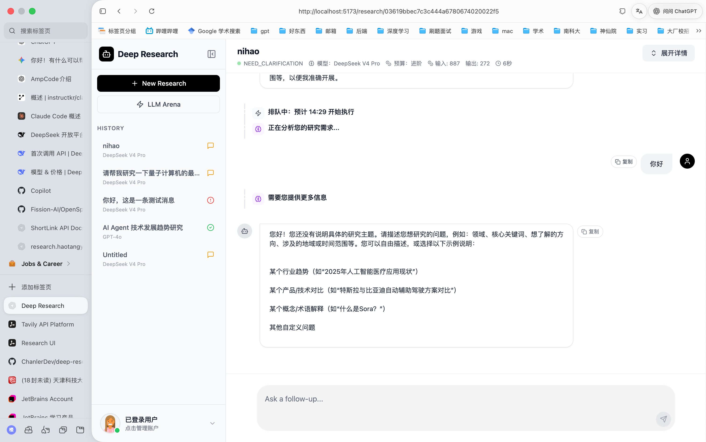
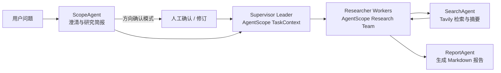

# Deep Research 深度研究

基于 FastAPI、AgentScope 2.x 和 React 的多智能体深度研究平台。系统覆盖需求澄清、研究方向确认、并行资料检索、网页摘要和 Markdown 报告生成，并通过 SSE 实时展示执行过程。



## 技术栈

- 后端：Python 3.11、FastAPI、Uvicorn、AgentScope 2.0.3
- 数据：MySQL、SQLAlchemy Async、Redis
- 前端：React、TypeScript、Vite、Tailwind CSS
- 搜索：Tavily Search
- 可观测性：OpenTelemetry、OTLP、Langfuse
- 测试：Pytest、真实 SSE smoke、真实 Mimo 工作流 smoke

## 项目结构

```text
deep-research-main/
├── backend-python/          # 当前后端
│   ├── app/
│   │   ├── api/             # REST/SSE 路由
│   │   ├── application/     # Agent、工作流、服务与工具
│   │   ├── core/            # 配置、认证、错误与通用工具
│   │   ├── domain/          # ORM、DTO、状态与运行时契约
│   │   └── infrastructure/  # DB、Redis、LLM、搜索与可观测性
│   └── tests/
├── frontend/                # React 前端
├── docs/                    # Python 当前实现文档
└── openspec/                # OpenSpec 配置
```

## 工作流


```mermaid
flowchart LR
    User["用户问题"] --> Scope["ScopeAgent<br/>澄清与研究简报"]
    Scope -->|"方向确认模式"| HITL["人工确认 / 修订"]
    HITL --> Supervisor
    Scope --> Supervisor["Supervisor Leader<br/>AgentScope TaskContext"]
    Supervisor --> Researcher["Researcher Workers<br/>AgentScope Research Team"]
    Researcher --> Search["SearchAgent<br/>Tavily 检索与摘要"]
    Search --> Researcher
    Researcher --> Report["ReportAgent<br/>生成 Markdown 报告"]
```

研究任务使用有界异步队列执行。外层 `AgentPipeline` 只维护可恢复的业务状态机；AgentScope 负责长生命周期 Agent、`AgentState`、上下文压缩、原生任务、Leader/Worker 团队、Toolkit、Middleware 和运行时事件。`MEDIUM`、`HIGH`、`ULTRA` 预算仍由代码硬约束子研究数、搜索次数、并发数和单次结果数。

## AgentScope 当前角色

AgentScope 已不再只是底层 Agent 调用适配器，而是项目的 **Agent 运行时与团队执行层**：

| 能力 | 初版接入 | 当前实现 |
|---|---|---|
| Agent 生命周期 | 每次调用临时执行 | 按研究会话复用 Scope、Supervisor、Researcher、Search、Report Agent |
| 状态 | 业务状态自行维护 | 业务状态与隔离 `AgentState`、版本化 runtime snapshot 协同 |
| 多 Agent 任务 | 自定义并发函数 | AgentScope `AgentState.tasks_context/Task` 承载任务状态，项目 Team 协调器按稳定 Worker ID 并发调度 |
| 运行治理 | 外层循环控制 | `ContextConfig`、Middleware、单次工具预算、失败隔离 |
| 可观测性 | 项目 Span 为主 | 同一 OTel Trace 中组合 workflow/stage 与 AgentScope agent/model/tool Span |

业务 Workflow 仍由 `AgentPipeline` 掌握，因为 QUEUE、HITL、断点恢复、MySQL/Redis 一致性属于产品状态机；AgentScope 掌握认知执行、任务上下文和运行时治理。这个边界避免把数据库事务和前端协议耦合到框架内部，同时让框架承担足够多的核心职责。

## 简历项目描述（协作维护）

> 以下五条是当前实现的唯一标准版本。后续技术升级时直接同步修改本节，项目协作者可据此更新简历。

**智能深度研究平台｜项目负责人**<br>
**FastAPI、AgentScope 2.0、React、MySQL、Redis、OpenTelemetry、Langfuse**

项目描述：构建基于多 Agent 协作的自动化深度研究平台，覆盖需求澄清、任务规划、并行检索、网页摘要、报告生成、人工确认、断点恢复与实时链路展示。

- **混合式多 Agent 研究工作流**：设计 `AgentPipeline + AgentScope Runtime` 分层架构，编排 ScopeAgent、SupervisorAgent、ResearcherAgent、SearchAgent、ReportAgent；业务状态机负责 QUEUE/HITL/恢复与持久化，AgentScope 负责认知执行和团队协作，兼顾协议稳定性与框架扩展能力。
- **AgentScope 原生运行时与团队任务**：基于长生命周期 `Agent + ReActConfig`、`Toolkit/ToolBase`、隔离 `AgentState`、`ContextConfig` 和 Middleware 构建执行层，并用 `AgentState.tasks_context/Task` 对接项目 Team 协调器，以稳定 Worker/Task ID、预算并发、失败隔离和版本化 snapshot 支撑复杂研究任务。
- **HITL 与可靠状态恢复**：实现研究方向 APPROVE/REVISE、失败续跑和取消清理；将业务 checkpoint、AgentScope 任务状态及有界 runtime snapshot 保存至 Redis，并通过数据库 CAS 限制合法状态迁移，避免重复执行和并发误操作。
- **SSE 实时进度与可解释 Agent Flow**：设计 MySQL + Redis ZSet 双写时间线和 `Last-Event-ID` 断线重放；通过 Event Bridge 将 AgentScope Team、Agent、模型和工具元数据映射为兼容事件，前端分层展示用户进度与诊断链路。
- **性能治理与全链路可观测性**：实现预算限流、搜索/摘要缓存、in-flight 合并、网页 AgentState 隔离、超时降级和报告输入上限；以 OpenTelemetry 贯通 `workflow → stage → AgentScope agent → model/tool` 并通过 OTLP 导出 Langfuse，支持 Token、延迟、异常和调用上下文追踪。

## 快速开始

前置依赖：Conda、MySQL 8.0+、Redis 6.0+。默认数据库为 `db_deep_research`，本地 MySQL 账号为 `root`，密码为 `12345678`。

```bash
conda env create -f backend-python/environment.yml
cp backend-python/.env.example backend-python/.env

cd backend-python
./start-python-backend.sh
```

另开终端启动前端：

```bash
cd frontend
npm install
npm run dev
```

- 后端：`http://127.0.0.1:8080`
- 健康检查：`http://127.0.0.1:8080/health`
- Scalar API 文档：`http://127.0.0.1:8080/scalar/index.html`
- OpenAPI：`http://127.0.0.1:8080/v3/api-docs`

模型配置从 MySQL `model` 表读取，完整链路测试默认查找数据库中的 `mimo` 模型。

## 测试

```bash
cd backend-python
conda run -n deep-research-py python -m compileall -q app tests
conda run -n deep-research-py pytest -q
conda run -n deep-research-py python tests/api_feature_smoke.py
PYTHONPATH=. conda run -n deep-research-py python tests/observability_smoke.py
PYTHONUNBUFFERED=1 conda run -n deep-research-py python tests/live_hybrid_workflow_smoke.py

cd ../frontend
npm run build
```

## 文档

- [后端开发与配置](backend-python/README.md)
- [架构设计](docs/架构设计.md)
- [API 与数据契约](docs/API与数据契约.md)
- [性能与可观测性](docs/性能与可观测性.md)
- [HITL 方向确认](docs/hitl.md)
