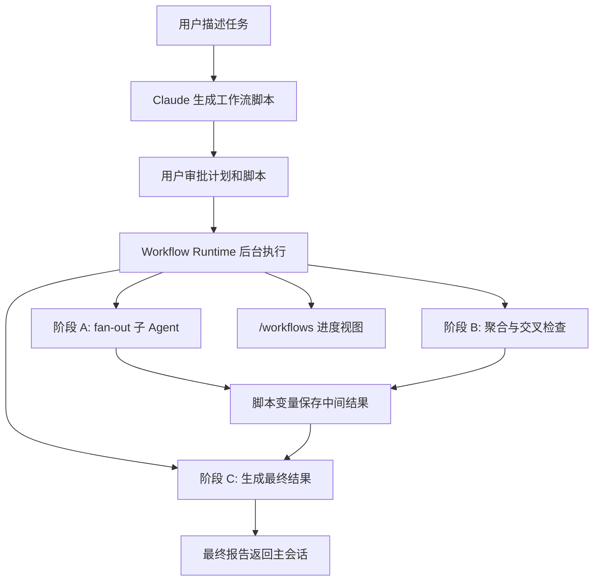

# Claude Code 动态工作流技术总结

参考来源：[Claude Code Dynamic Workflows 官方文档](https://code.claude.com/docs/en/workflows)

## 1. 核心概念

Claude Code 的 Dynamic Workflows 是一种面向大规模多 Agent 编排的机制。它不是让主对话轮流决定下一步做什么，而是由 Claude 根据用户任务生成一段 JavaScript 工作流脚本，再由独立运行时在后台执行。脚本负责保存计划、循环、分支和中间结果，主会话只接收最终结果或进度视图。

这种设计的关键变化是：编排权从“对话上下文中的即时决策”转移到“可阅读、可复用、可恢复的脚本”。因此，它适合代码库审计、大规模迁移、跨来源研究、多方案计划评审等需要大量并行子任务和交叉验证的场景。

## 2. 与其他 Agent 机制的区别

| 机制 | 编排主体 | 中间结果位置 | 可复用内容 | 适合规模 |
|------|----------|--------------|------------|----------|
| Subagents | 主 Claude 按轮次分派 | Claude 上下文窗口 | 子 Agent 定义 | 少量委派任务 |
| Skills | Claude 按技能说明执行 | Claude 上下文窗口 | 技能说明和脚本 | 明确流程或工具用法 |
| Agent Teams | Lead Agent 管理多个同伴会话 | 共享任务列表 | Team 定义 | 少量长任务并行 |
| Dynamic Workflows | 工作流脚本 | 脚本变量和运行时状态 | 编排脚本本身 | 数十到数百个 Agent |

Dynamic Workflow 的核心优势不是单纯“开更多 Agent”，而是让质量控制模式也能被编码。例如，一个研究流程可以让多个 Agent 独立检索同一主题，再由审查 Agent 交叉验证来源、过滤不可靠结论，最后只输出通过审查的 claim。

## 3. 运行流程

典型流程如下：



执行期间，主会话保持可响应。用户可以通过 `/workflows` 查看运行中和已完成的工作流，进度视图会展示每个阶段的 Agent 数量、token 用量和耗时，并允许查看单个 Agent 的 prompt、工具调用和结果。

## 4. 触发与复用

Claude Code 支持多种触发方式：

- 直接运行内置工作流，例如 `/deep-research <question>`。
- 在任务中显式要求使用 workflow 或使用 `ultracode` 关键词。
- 将 `/effort` 设置为 `ultracode`，让 Claude 对实质性任务自动判断是否需要工作流。
- 将一次成功的工作流保存为命令，后续在项目或个人环境中重复运行。

保存后的 workflow 可以接受 `args` 输入。脚本会把参数作为结构化数据读取，适合传入研究问题、目标文件列表、Issue 编号或配置对象。这让工作流从“一次性计划”变成“可参数化的自动化命令”。

## 5. 审批、权限与隔离

工作流运行前通常会显示计划和阶段列表，用户可以选择运行、查看原始脚本、取消，或对当前项目中的同名工作流记住授权。不同权限模式下提示行为不同，但有几个原则保持一致：

- 工作流脚本在独立环境中执行，不直接访问文件系统或 shell。
- 文件读写、命令执行、Web 获取、MCP 工具调用由被编排的 Agent 执行。
- Agent 继承用户当前工具 allowlist，未授权工具可能在运行中继续请求确认。
- 子 Agent 默认以可接受编辑的模式运行，适合长任务自动推进。

这种权限模型把“编排逻辑”和“具体工具行为”分开，既保留了自动化能力，也避免工作流脚本直接拥有过大的系统权限。

## 6. 行为边界与成本控制

官方文档列出的关键边界包括：

- 工作流运行中不接受任意用户输入；如果需要阶段间人工确认，应拆成多个工作流。
- 工作流脚本本身不直接进行文件系统或 shell 操作，只负责协调 Agent。
- 单次运行最多 16 个并发 Agent，资源受限机器上可能更少。
- 单次运行最多 1,000 个 Agent，避免失控循环。
- 运行可暂停、恢复或停止；已完成 Agent 的结果可以缓存复用。

由于 workflow 可能启动大量 Agent，成本控制必须成为一等设计。实践上应先在小范围上试跑，比如只检查一个目录、只研究一个子问题，确认流程质量后再扩大范围。进度视图中的 token 用量也应作为中止或缩小任务范围的依据。

## 7. `/deep-research` 内置工作流的启发

Claude Code 内置的 `/deep-research` 会围绕问题从多个角度 fan-out 搜索，获取并交叉检查来源，对 claim 进行投票或过滤，最后返回带引用的报告。这个流程体现了动态工作流对研究质量的三个关键提升：

1. 多角度并行探索：不同 Agent 可以从不同关键词、领域或假设出发，减少单一路径遗漏。
2. 来源交叉验证：一个 Agent 的发现不直接进入最终报告，需要被其他来源或审查步骤支持。
3. 结论过滤：没有通过交叉检查的 claim 被过滤，而不是作为低置信度内容混入报告。

对 Deep Research 这样的研究系统来说，这比固定的 Supervisor-Researcher 循环更接近“可验证研究流水线”。

## 8. 对 Deep Research 的架构借鉴

当前 Deep Research 已具备多 Agent 协作、工具注册、预算限制、SSE 进度、持久化状态和运行时适配能力。Dynamic Workflows 可以作为下一阶段演进方向，而不是替代现有架构。

建议分阶段引入：

### 8.1 工作流脚本化

将当前固定的 Scope -> Supervisor -> Researcher -> Report 流程抽象为可声明的 workflow plan。计划可以描述阶段、并发度、工具集、预算和产出 schema。初期不需要真正执行 JavaScript，可以先用 Java DSL 或 YAML 表达：

```yaml
workflow:
  phases:
    - name: scope
      agent: ScopeAgent
    - name: fanout-research
      agent: ResearcherAgent
      parallelism: 3
      strategy: by-perspective
    - name: cross-check
      agent: ReviewerAgent
    - name: report
      agent: ReportAgent
```

### 8.2 中间结果结构化

把研究笔记从普通文本升级为结构化 evidence、claim、source、confidence。这样后续才能支持交叉审查、claim voting 和来源过滤。

### 8.3 并行 Researcher 与审查 Agent

引入多个 Researcher 并行处理不同视角，例如政策、技术、市场、风险。再引入 ReviewerAgent 对 claim 做冲突检测、来源覆盖度检查和证据强度评估。

### 8.4 可观测和可恢复运行

SSE 事件可以从“线性进度消息”升级为“workflow phase + agent run”的层级结构。用户可以看到每个阶段的耗时、token、工具调用和完成状态。结合 Redis/MySQL 保存 agent run，可以实现暂停、恢复和部分重跑。

### 8.5 成本与安全边界

沿用现有 Budget 机制，扩展为 workflow 级预算：

- 最大并发 Agent 数。
- 最大 Agent 总数。
- 每阶段最大 token。
- 每阶段最大工具调用数。
- 失败重试和降级策略。

这样可以在提升研究深度的同时，避免无限 fan-out 或成本失控。

## 9. 总结

Dynamic Workflows 的本质是把 Agent 编排从“会话内即时推理”升级为“可执行、可审查、可复用的动态计划”。它适合任务规模大、可并行、需要交叉验证、希望沉淀为固定自动化流程的场景。

Deep Research 当前的架构已经具备引入该思想的基础：Agent 有清晰边界，工具系统可注册，状态可持久化，前端能展示事件流，运行时也已与具体 LLM 框架解耦。下一步如果要提升研究质量，重点不应只是增加 Agent 数量，而应把多 Agent 的分工、审查、投票、证据过滤和恢复能力设计成可配置的动态工作流。
