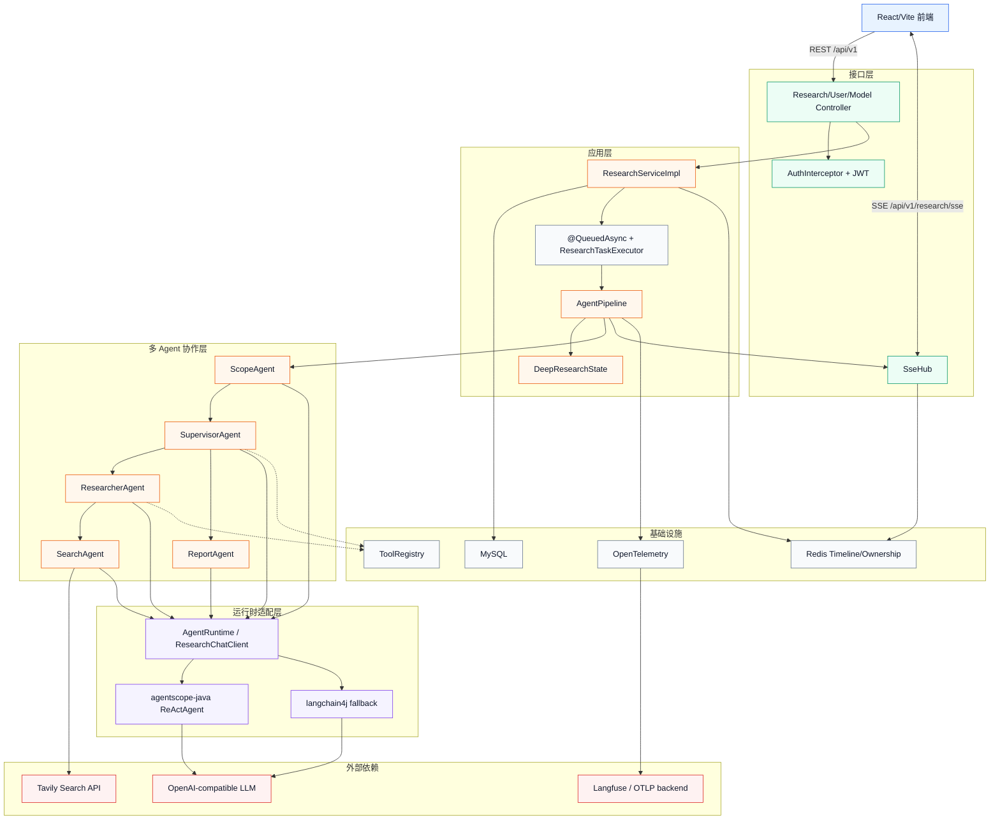
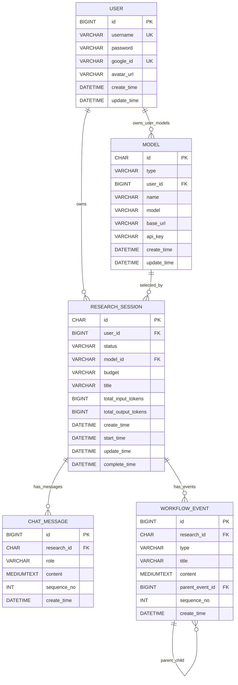
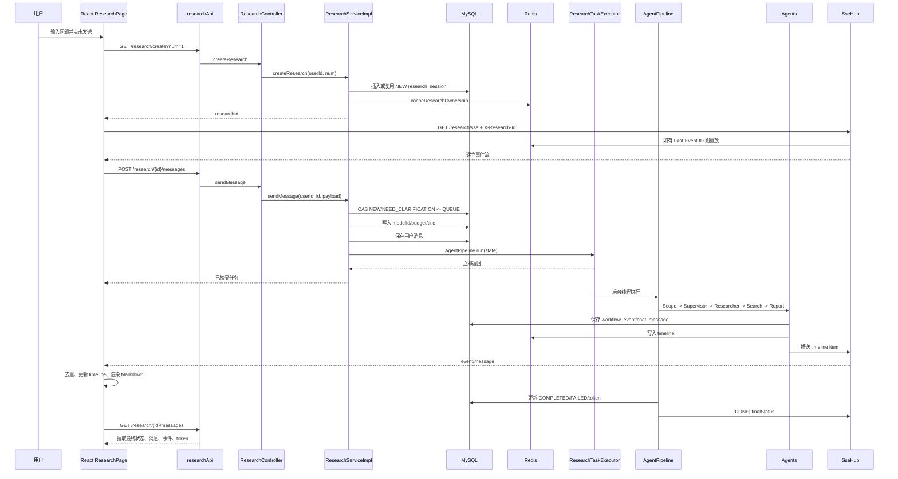
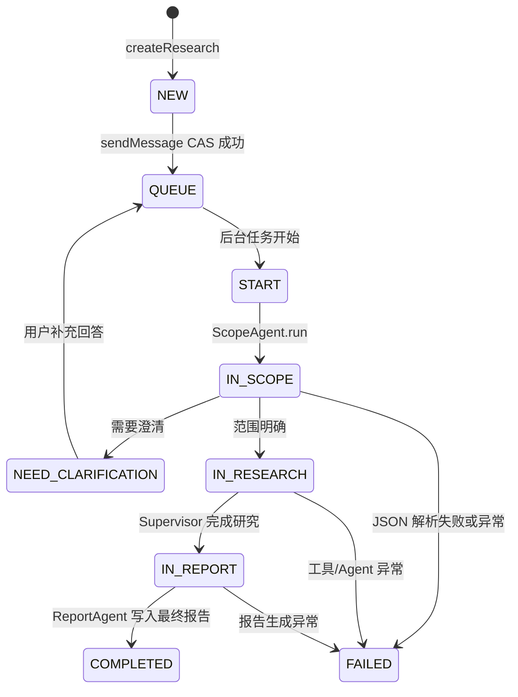
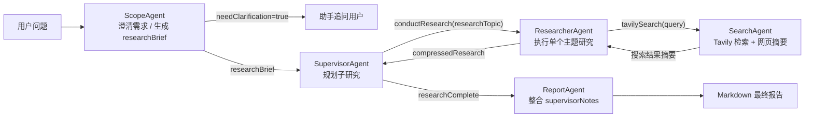
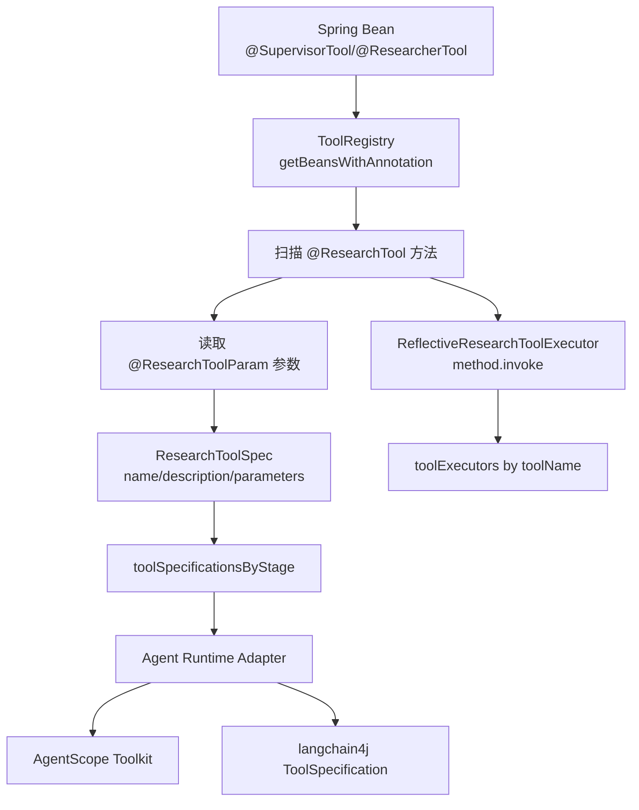
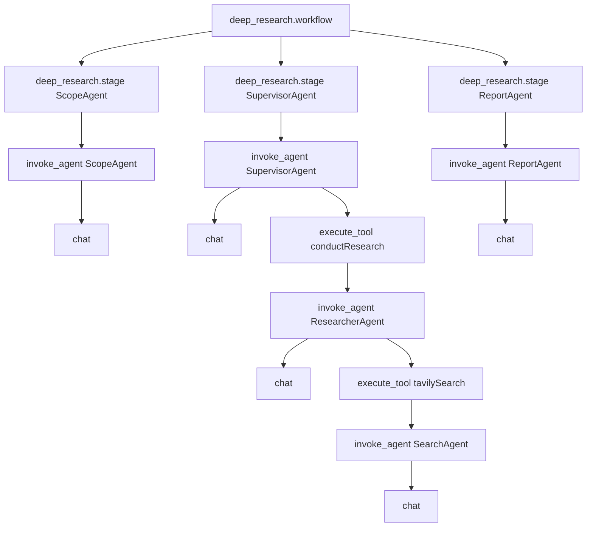
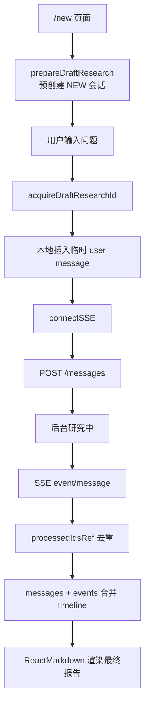

# Deep Research 项目技术文档

> 面向新成员的开发导览。本文基于当前仓库源码、`src/main/resources/data.sql`、后端关键 Java 类和前端源码结构整理，帮助团队快速理解系统边界、核心链路和扩展方式。

## 目录

- [1. 快速开始](#1-快速开始)
- [2. 项目代码地图](#2-项目代码地图)
- [3. 整体架构设计](#3-整体架构设计)
- [4. 数据库设计](#4-数据库设计)
- [5. 从请求到响应的完整链路](#5-从请求到响应的完整链路)
- [6. Agent 执行流程](#6-agent-执行流程)
- [7. 工具系统设计](#7-工具系统设计)
- [8. Agent Runtime 设计](#8-agent-runtime-设计)
- [9. 可观测性实现](#9-可观测性实现)
- [10. 前端源码结构与状态流](#10-前端源码结构与状态流)
- [11. 配置说明](#11-配置说明)
- [12. 异常处理、幂等与可靠性](#12-异常处理幂等与可靠性)
- [13. 开发扩展指南](#13-开发扩展指南)
- [14. 常见问题 FAQ](#14-常见问题-faq)
- [15. 关键类与方法速查](#15-关键类与方法速查)

## 1. 快速开始

### 概述

Deep Research 是一个参考 LangChain `open-deep-research` 思路实现的自动化深度研究系统。后端使用 Spring Boot 3 + Java 21，前端使用 React + Vite，核心能力由多 Agent Pipeline 完成：需求澄清、研究规划、网页搜索、资料压缩和最终报告生成。

### 详细说明

本地运行需要这些依赖：

| 组件 | 版本或要求 | 用途 |
|---|---:|---|
| Java | 21 | Spring Boot 后端运行 |
| Maven | 3.8+ | 后端构建 |
| MySQL | 8.0+ | 用户、会话、消息、事件、模型配置 |
| Redis | 6.0+ | SSE timeline 缓存、断线重放、权限映射缓存 |
| Node.js | 建议 18+ | 前端 Vite 开发环境 |
| Tavily API Key | 必需，执行真实搜索时使用 | Web 搜索 |
| OpenAI-compatible LLM API | 必需 | Agent 推理与报告生成 |

注意：`application.yaml` 中 `spring.sql.init.mode=never`，后端启动时不会自动执行 `data.sql`。本地可通过 `start.sh` 初始化数据库，也可以手动执行 SQL。

### 示例

#### 后端一键启动

```bash
cp .env.example .env
vim .env
./start.sh
```

`start.sh` 会检查 Java、Maven、MySQL、Redis，创建数据库，执行 `src/main/resources/data.sql`，然后打包并启动后端。

#### 后端手动启动

```bash
mysql -uroot -p -e "CREATE DATABASE IF NOT EXISTS db_deep_research DEFAULT CHARACTER SET utf8mb4 COLLATE utf8mb4_unicode_ci;"
mysql -uroot -p db_deep_research < src/main/resources/data.sql
mvn clean package -DskipTests
java -jar target/researcher-0.0.1-SNAPSHOT.jar
```

后端默认端口：`http://localhost:8080`

API 文档：

- Scalar UI：`http://localhost:8080/scalar/index.html`
- OpenAPI JSON：`http://localhost:8080/v3/api-docs`

#### 前端启动

```bash
cd frontend
npm install
npm run dev
```

前端默认访问：`http://localhost:5173`

Vite 会把 `/api` 代理到 `API_BASE_URL`，默认是 `http://localhost:8080`。

#### 最小 API 调用流程

```bash
# 1. 注册并拿 token
curl -s -X POST http://localhost:8080/api/v1/user/register \
  -H 'Content-Type: application/json' \
  -d '{"username":"dev","password":"dev123"}'

# 2. 创建研究会话。注意：当前源码中是 GET，不是 POST。
curl -s 'http://localhost:8080/api/v1/research/create?num=1' \
  -H 'Authorization: Bearer <token>'

# 3. 发送研究问题。modelId 需要先通过 /api/v1/models 获取或新增。
curl -s -X POST http://localhost:8080/api/v1/research/<researchId>/messages \
  -H 'Authorization: Bearer <token>' \
  -H 'Content-Type: application/json' \
  -d '{"content":"研究 2026 年 AI Agent 工程化趋势","modelId":"<modelId>","budget":"HIGH"}'
```

## 2. 项目代码地图

### 概述

仓库采用前后端同仓结构。后端按 interfaces、application、domain、infra 分层，前端按 services、contexts、components、pages 组织。

### 详细说明

#### 后端目录

| 目录 | 职责 | 典型文件 |
|---|---|---|
| `interfaces/controller` | HTTP Controller | `ResearchController`、`UserController`、`ModelController` |
| `interfaces/service` | 接口层服务契约与实现 | `ResearchServiceImpl`、`ModelServiceImpl` |
| `application/workflow` | 工作流编排 | `AgentPipeline` |
| `application/agent` | 多 Agent 实现 | `ScopeAgent`、`SupervisorAgent`、`ResearcherAgent`、`SearchAgent`、`ReportAgent` |
| `application/agent/runtime` | 框架无关 LLM/Agent SPI | `AgentRuntime`、`ResearchChatClient`、`ResearchAgentRequest` |
| `application/agent/runtime/agentscope` | AgentScope Java 适配 | `AgentscopeJavaChatClient`、`FixedOtelTracingMiddleware` |
| `application/agent/runtime/langchain4j` | langchain4j 备份运行时 | `Langchain4jChatClient` |
| `application/tool` | 工具注册、工具注解、工具执行器 | `ToolRegistry`、`ReflectiveResearchToolExecutor` |
| `application/state` | 工作流状态 | `DeepResearchState` |
| `domain/entity` | MyBatis-Plus 实体 | `ResearchSession`、`ChatMessage`、`WorkflowEvent` |
| `domain/mapper` | MyBatis Mapper | `ResearchSessionMapper`、`ModelMapper` |
| `infra/sse` | SSE 连接、心跳、重放 | `SseHub` |
| `infra/async` | 有界异步队列 | `QueuedAsyncAspect`、`ResearchTaskExecutor` |
| `infra/observability` | OpenTelemetry/Langfuse | `ResearchObservation`、`ObservabilityConfiguration` |
| `infra/util` | JWT、缓存、序列号、消息转换 | `CacheUtil`、`EventPublisher`、`SequenceUtil` |
| `infra/client` | 外部 API 客户端 | `TavilyClient` |

#### 前端目录

| 目录 | 职责 | 典型文件 |
|---|---|---|
| `frontend/src/services` | API 调用封装、token 存取 | `api.ts`、`auth.ts` |
| `frontend/src/contexts` | React Context | `AuthContext.tsx` |
| `frontend/src/components` | 复用组件 | `AuthModal.tsx`、`ModelManagerModal.tsx` |
| `frontend/src/pages` | 独立页面 | `ArenaPage.tsx` |
| `frontend/src/constants` | 前端常量 | `budget.ts`、`time.ts` |
| `frontend/src/App.tsx` | 主页面、路由、普通研究流程 | `ResearchPage`、`Sidebar` |

### 示例

```text
src/main/java/dev/haotangyuan/researcher/
├── interfaces/      # REST API 和服务入口
├── application/     # Agent、工具、状态、工作流
├── domain/          # 实体和 Mapper
└── infra/           # 认证、SSE、Redis、异步、可观测性、外部客户端

frontend/src/
├── services/        # axios + SSE URL 封装
├── contexts/        # 登录态
├── components/      # 弹窗和用户菜单
├── pages/           # Arena 多模型对比
└── App.tsx          # 普通研究页面和路由
```

## 3. 整体架构设计

### 概述

系统采用“前端交互层 + REST/SSE 接口层 + 后台异步工作流 + 多 Agent 协作层 + 可切换 LLM 运行时 + 工具与基础设施”的分层架构。前端发送任务后，后端立即返回“已接受任务”，耗时研究在有界线程池中执行，进度通过 SSE 推送。

### 详细说明



#### 设计决策与权衡

| 决策 | 当前实现 | 收益 | 代价或注意点 |
|---|---|---|---|
| HTTP 接任务 + 后台异步执行 | `ResearchServiceImpl.sendMessage()` 调用 `AgentPipeline.run()`，由 `@QueuedAsync` 切面提交线程池 | HTTP 线程不被长任务占用 | 需要 SSE/轮询补偿进度和结果同步 |
| SSE 而非 WebSocket | `SseHub` 推送 timeline item | 单向进度推送足够，浏览器支持简单 | 客户端到服务端的实时控制能力弱 |
| Redis ZSet 缓存 timeline | `research:{id}:timeline`，score 为 `sequenceNo` | 支持断线重放和快速历史读取 | Redis 只保留 30 分钟 TTL，长期历史回源 MySQL |
| 中心化状态对象 | `DeepResearchState` 贯穿 Pipeline | Agent 间上下文、预算、token 统一管理 | 状态字段较多，需要控制职责边界 |
| 工具注解注册 | `@SupervisorTool` / `@ResearcherTool` + `@ResearchTool` | 工具声明与 runtime 解耦 | 跨阶段同名工具会共享 executor，命名需要全局唯一 |
| 默认 AgentScope | `agentscope-java` 原生 `ReActAgent` | 运行时接管 tool loop，观测粒度更细 | 需要自定义 OTel middleware 处理 Reactor 上下文 |
| 保留 langchain4j | `RESEARCH_AGENT_FRAMEWORK=langchain4j` | 可回滚、便于兼容 OpenAI-compatible API | 工具循环由项目默认 `runAgent()` 执行，观测能力不同 |

### 示例

普通研究的粗粒度调用路径：

```text
ResearchPage.sendMessage()
  -> researchApi.sendMessage()
  -> ResearchController.sendMessage()
  -> ResearchServiceImpl.sendMessage()
  -> AgentPipeline.run(state)  # 被 @QueuedAsync 切到后台线程
  -> ScopeAgent
  -> SupervisorAgent
  -> ResearcherAgent
  -> SearchAgent
  -> ReportAgent
  -> EventPublisher.publishMessage()
  -> SseHub.sendTimelineItem()
  -> ReactMarkdown 渲染最终报告
```

## 4. 数据库设计

### 概述

数据库由 `src/main/resources/data.sql` 管理。当前没有 ORM 迁移工具，新增表或字段需要同步修改 SQL 文件和开发记录。

核心表共 5 张：

- `user`：用户账号。
- `research_session`：研究会话、状态机、模型、预算和 token 统计。
- `model`：全局或用户自定义模型配置。
- `chat_message`：用户与助手消息。
- `workflow_event`：Agent 工作流事件。

### 详细说明

#### ER 图



#### `user` 表

| 字段 | 类型 | 含义 | 代码映射 |
|---|---|---|---|
| `id` | `BIGINT UNSIGNED` | 用户 ID，自增主键 | `User.id` |
| `username` | `VARCHAR(128)` | 用户名，唯一 | `UserServiceImpl.register/login` |
| `password` | `VARCHAR(128)` | 密码 | 当前源码直接明文比较，生产环境应改为哈希 |
| `google_id` | `VARCHAR(64)` | Google OpenID，预留 | 当前主流程未使用 |
| `avatar_url` | `VARCHAR(512)` | DiceBear 头像 URL | 注册时生成 |
| `create_time` | `DATETIME` | 创建时间 | 实体字段 |
| `update_time` | `DATETIME` | 更新时间 | 实体字段 |

索引：

| 索引 | 字段 | 用途 |
|---|---|---|
| `UNIQUE(username)` | `username` | 注册查重、登录查询 |
| `UNIQUE(google_id)` | `google_id` | OAuth 账号唯一性预留 |
| `idx_google_id` | `google_id` | Google 登录查找 |
| `idx_username` | `username` | 用户名登录查找 |

#### `research_session` 表

| 字段 | 类型 | 含义 | 代码映射 |
|---|---|---|---|
| `id` | `CHAR(32)` | 研究 ID，MyBatis-Plus `ASSIGN_UUID` | `ResearchSession.id` |
| `user_id` | `BIGINT UNSIGNED` | 所属用户 | 权限校验、列表查询 |
| `status` | `VARCHAR(32)` | 状态机状态 | `WorkflowStatus` |
| `model_id` | `VARCHAR(256)` | 首条消息锁定的模型配置 ID | `ResearchServiceImpl.sendMessage()` |
| `budget` | `VARCHAR(16)` | `MEDIUM` / `HIGH` / `ULTRA` | `BudgetProps.getLevel()` |
| `title` | `VARCHAR(256)` | 会话标题，默认首条消息前 20 字 | 前端历史列表 |
| `total_input_tokens` | `BIGINT UNSIGNED` | 累计输入 token | `AgentPipeline.updateResearchSession()` |
| `total_output_tokens` | `BIGINT UNSIGNED` | 累计输出 token | 同上 |
| `create_time` | `DATETIME` | 创建时间 | 创建研究时写入 |
| `start_time` | `DATETIME` | 开始执行时间 | 状态进入 `START` 时写入 |
| `update_time` | `DATETIME` | 更新时间 | 状态变更时更新 |
| `complete_time` | `DATETIME` | 完成、失败或需澄清时间 | `COMPLETED` / `FAILED` / `NEED_CLARIFICATION` |

状态枚举：

| 状态 | 含义 |
|---|---|
| `NEW` | 新建但未发送首条研究消息 |
| `QUEUE` | 已接受任务，等待后台队列执行 |
| `START` | 后台任务开始执行 |
| `IN_SCOPE` | 需求范围分析中 |
| `NEED_CLARIFICATION` | 需要用户补充信息 |
| `IN_RESEARCH` | 规划和子主题研究中 |
| `IN_REPORT` | 报告生成中 |
| `COMPLETED` | 完成 |
| `FAILED` | 失败 |

索引：

| 索引 | 字段 | 用途 |
|---|---|---|
| `idx_user_status` | `(user_id, status)` | 查询用户未使用草稿、按状态筛选 |
| `idx_user_update` | `(user_id, update_time DESC)` | 用户历史列表倒序查询 |

关键 SQL：

```java
@Update("""
    UPDATE research_session
    SET status = 'QUEUE', update_time = NOW()
    WHERE id = #{id} AND user_id = #{userId}
      AND status IN ('NEW', 'NEED_CLARIFICATION')
    """)
int casUpdateToQueue(@Param("id") String id, @Param("userId") Long userId);
```

这个 CAS 更新保证同一个会话只能从 `NEW` 或 `NEED_CLARIFICATION` 启动，避免重复点击或浏览器重试造成重复研究。

#### `model` 表

| 字段 | 类型 | 含义 | 代码映射 |
|---|---|---|---|
| `id` | `CHAR(32)` | 模型配置 ID，UUID | `Model.id` |
| `type` | `VARCHAR(16)` | `GLOBAL` 或 `USER` | `ModelServiceImpl` |
| `user_id` | `BIGINT UNSIGNED` | 自定义模型拥有者 | `USER` 类型必需 |
| `name` | `VARCHAR(128)` | 前端展示名 | 模型选择器 |
| `model` | `VARCHAR(128)` | 传给 LLM API 的模型名 | `OpenAIChatModel.modelName` |
| `base_url` | `VARCHAR(256)` | OpenAI-compatible base URL | runtime 构造模型 |
| `api_key` | `VARCHAR(256)` | API key | runtime 构造模型 |
| `create_time` | `DATETIME` | 创建时间 | 列表排序 |
| `update_time` | `DATETIME` | 更新时间 | 审计 |

索引：

| 索引 | 字段 | 用途 |
|---|---|---|
| `idx_type_user_create` | `(type, user_id, create_time DESC)` | 查询全局模型和当前用户模型 |

删除约束在业务层实现：`deleteCustomModel()` 会调用 `countActiveUsage(modelId)`，若模型仍被未完成研究使用，则拒绝删除。

#### `chat_message` 表

| 字段 | 类型 | 含义 |
|---|---|---|
| `id` | `BIGINT UNSIGNED` | 消息 ID，自增 |
| `research_id` | `CHAR(32)` | 所属研究 |
| `role` | `VARCHAR(16)` | `user` 或 `assistant` |
| `content` | `MEDIUMTEXT` | 消息正文，最终报告也作为 assistant 消息写入 |
| `sequence_no` | `INT UNSIGNED` | 全 timeline 递增序号 |
| `create_time` | `DATETIME` | 创建时间 |

索引：

| 索引 | 字段 | 用途 |
|---|---|---|
| `idx_research_seq` | `(research_id, sequence_no)` | 按研究会话恢复消息顺序 |

#### `workflow_event` 表

| 字段 | 类型 | 含义 |
|---|---|---|
| `id` | `BIGINT UNSIGNED` | 事件 ID，自增 |
| `research_id` | `CHAR(32)` | 所属研究 |
| `type` | `VARCHAR(32)` | `QUEUE`、`SCOPE`、`SUPERVISOR`、`RESEARCH`、`SEARCH`、`REPORT`、`ERROR` |
| `title` | `VARCHAR(512)` | 前端事件标题，发布时超过 200 字会截断 |
| `content` | `MEDIUMTEXT` | 事件详情 |
| `parent_event_id` | `BIGINT UNSIGNED` | 父事件 ID，前端用来构建树 |
| `sequence_no` | `INT UNSIGNED` | 全 timeline 递增序号 |
| `create_time` | `DATETIME` | 创建时间 |

索引：

| 索引 | 字段 | 用途 |
|---|---|---|
| `idx_research_seq` | `(research_id, sequence_no)` | SSE 重放、历史 timeline 排序 |
| `idx_parent` | `parent_event_id` | 前端事件树和后续层级查询 |

### 示例

消息和事件共享一个 timeline 序号。`SequenceUtil.next(researchId)` 会查询 `chat_message` 与 `workflow_event` 的最大 `sequence_no` 后递增：

```java
@Select("""
    SELECT COALESCE(MAX(sequence_no), 0) FROM (
        SELECT sequence_no FROM chat_message WHERE research_id = #{researchId}
        UNION ALL
        SELECT sequence_no FROM workflow_event WHERE research_id = #{researchId}
    ) t
    """)
Integer selectMaxSequenceByResearchId(@Param("researchId") String researchId);
```

这让前端可以把消息和 Agent 事件合并成一条时间线，而不需要分别排序两类数据后再推断相对顺序。

## 5. 从请求到响应的完整链路

### 概述

普通研究页面的完整链路包含三条流：

1. REST 流：创建会话、发送消息、查询状态和历史。
2. SSE 流：实时接收工作流事件与最终消息。
3. 后台工作流：`@QueuedAsync` 异步执行 Agent Pipeline。

### 详细说明

#### 端到端时序图



#### 前端发起路径

普通研究的入口在 `frontend/src/App.tsx` 的 `ResearchPage.sendMessage()`：

1. 读取输入框内容。
2. 如果没有当前 `researchId`，调用 `acquireDraftResearchId()` 获取或创建一个 `NEW` 会话。
3. 构造临时用户消息，立即在 UI 中显示。
4. 调用 `connectSSE(newId, { resetCursor: true })` 先建立事件流。
5. 调用 `researchApi.sendMessage(newId, content, { modelId, budget })` 启动后端任务。
6. 导航到 `/research/{newId}`。

#### 后端处理路径

`ResearchServiceImpl.sendMessage()` 是启动研究的后端核心：

1. `researchSessionMapper.casUpdateToQueue(researchId, userId)` 做幂等状态更新。
2. 如果是新会话，校验 `modelId`，设置 `model_id`、`budget`、`title`。
3. `modelService.getModelById(userId, modelId)` 校验模型权限。
4. `modelHandler.addModel(researchId, model)` 为当前研究创建 `ResearchChatClient`。
5. `cacheUtil.saveMessage(researchId, "user", content)` 落库用户消息并写 Redis timeline。
6. 查询历史消息并转换为 `ResearchMessage` 列表。
7. 构建 `DeepResearchState`。
8. 调用 `agentPipeline.run(state)`，由于方法上有 `@QueuedAsync`，实际会进入后台线程池。

#### 状态机



### 示例

#### SSE 请求头

后端 `ResearchController.stream()` 要求使用请求头传递研究 ID 和客户端 ID：

```http
GET /api/v1/research/sse HTTP/1.1
Authorization: Bearer <token>
X-Research-Id: <researchId>
X-Client-Id: <browser-session-client-id>
Last-Event-ID: 12
```

前端实际使用 `@microsoft/fetch-event-source`：

```ts
fetchEventSource(researchApi.getSseUrl(), {
  method: 'GET',
  headers: {
    'X-Research-Id': researchId,
    'X-Client-Id': clientId,
    Authorization: `Bearer ${token}`,
    'Last-Event-Id': lastEventId,
  },
  onmessage: (msg) => {
    if (msg.id) lastEventIdMapRef.current[researchId] = msg.id;
    if (msg.data?.startsWith('[DONE]')) {
      syncResearchStatus(researchId);
      return;
    }
    const data = JSON.parse(msg.data);
    // data.kind === 'event' 或 'message'
  },
});
```

HTTP header 名大小写不敏感，因此前端 `Last-Event-Id` 可以被后端 `Last-Event-ID` 读取。

## 6. Agent 执行流程

### 概述

多 Agent 协作链路为：

```text
ScopeAgent -> SupervisorAgent -> ResearcherAgent -> SearchAgent -> ReportAgent
```

用户特别关注的协作机制是：

```text
ScopeAgent -> SupervisorAgent -> ResearcherAgent -> SearchAgent
```

其中 ReportAgent 是最后的报告生成阶段。

### 详细说明

#### Agent 协作图



#### `ScopeAgent`

职责：

- 根据历史对话判断是否需要澄清。
- 如果需要澄清，写入 assistant 消息并将状态设为 `NEED_CLARIFICATION`。
- 如果范围明确，将对话转成 `researchBrief`，供 Supervisor 使用。

关键方法：

```java
public void run(DeepResearchState state)
```

内部调用：

```text
run()
  -> clarifyUserInstructions()
       -> LLM 输出 ClarifyWithUserSchema JSON
       -> needClarification=true: publishMessage + NEED_CLARIFICATION
       -> needClarification=false: publishEvent "研究需求已明确"
  -> writeResearchBrief()
       -> LLM 输出 ResearchQuestion JSON
       -> state.researchBrief = researchQuestion.researchBrief()
```

失败策略：

- JSON 解析失败会记录日志并设置 `WorkflowStatus.FAILED`。
- Pipeline 看到 `FAILED` 后写失败状态并结束。

#### `SupervisorAgent`

职责：

- 基于 `researchBrief` 制定研究路线。
- 使用 Supervisor 阶段工具：`thinkTool`、`conductResearch`、`researchComplete`。
- 每次 `conductResearch` 委托 `ResearcherAgent` 执行一个子主题。

关键方法：

```java
public void run(DeepResearchState state)
```

调用链：

```text
run()
  -> 构造 LEAD_RESEARCHER_PROMPT
  -> plan()
       -> toolRegistry.getToolSpecifications("SupervisorTool")
       -> chatClient.runAgent(ResearchAgentRequest(...))
       -> executeTool()
            -> conductResearch: 检查 maxConductCount
            -> executeConductResearch()
                 -> 解析 researchTopic
                 -> researcherAgent.run(state)
            -> other tools: toolRegistry.getExecutor(name).execute()
```

预算规则：

```java
int maxConductCount = state.getBudget().getMaxConductCount();
if (state.getConductCount() >= maxConductCount) {
    return "已达到研究任务配额限制，请调用 researchComplete 完成研究";
}
```

注意：`maxConcurrentUnits` 当前被注入到 Supervisor prompt 中作为模型规划约束；从当前 Java 实现看，`conductResearch` 工具回调仍是同步执行，没有单独的并发调度器。

#### `ResearcherAgent`

职责：

- 围绕单个 `researchTopic` 做迭代研究。
- 使用 Researcher 阶段工具：`thinkTool`、`tavilySearch`。
- 将搜索和思考历史压缩成一段 `compressedResearch`，返回 Supervisor。

关键方法：

```java
public String run(DeepResearchState state)
```

调用链：

```text
run()
  -> plan()
       -> toolRegistry.getToolSpecifications("ResearcherTool")
       -> chatClient.runAgent()
       -> executeTool()
            -> tavilySearch: 检查 maxSearchCount
            -> executeSearchTool()
                 -> 解析 query/maxResults/topic
                 -> searchAgent.run(state)
            -> thinkTool: 记录分析事件
  -> compressResearch()
       -> 将工具调用历史压缩为 compressedResearch
       -> 写入 RESEARCH 事件
```

#### `SearchAgent`

职责：

- 调用 Tavily 搜索。
- 按 URL 去重。
- 对长网页内容做 LLM 摘要。
- 输出标准化搜索结果文本给 Researcher。

关键方法：

```java
public String run(DeepResearchState state)
```

调用链：

```text
run()
  -> plan()
       -> tavilyClient.search(query, maxResults, topic, true)
       -> URL 去重
  -> action()
       -> rawContent/content 长度 > 500: summarizeWebpage()
       -> 否则直接使用 Tavily content
  -> summarize()
       -> 拼接 SOURCE 1..N
```

摘要失败回退：

```java
catch (Exception e) {
    SummarySchema fallback = new SummarySchema();
    fallback.setSummary(webpageContent.substring(0, Math.min(1000, webpageContent.length())));
    fallback.setKeyExcerpts("");
    return fallback;
}
```

#### `ReportAgent`

职责：

- 基于 `researchBrief` 和 `state.supervisorNotes` 生成最终 Markdown 报告。
- 发布 `REPORT` 事件。
- 将最终报告作为 assistant 消息写入 `chat_message`，供前端渲染。

关键方法：

```java
public String run(DeepResearchState state)
public void action(AgentAbility agent, DeepResearchState state)
```

### 示例

一次 HIGH 预算研究的典型循环：

```text
1. ScopeAgent 判断问题足够明确，生成 researchBrief。
2. SupervisorAgent 第 1 次调用 conductResearch，研究子主题 A。
3. ResearcherAgent 第 1 次调用 tavilySearch，SearchAgent 返回 SOURCE 列表。
4. ResearcherAgent 调用 thinkTool 记录缺口。
5. ResearcherAgent 第 2 次调用 tavilySearch，补充证据。
6. ResearcherAgent compressResearch，返回给 Supervisor。
7. SupervisorAgent 第 2 次调用 conductResearch，研究子主题 B。
8. SupervisorAgent 调用 researchComplete。
9. ReportAgent 生成 Markdown 报告。
```

预算配置示例：

```yaml
research:
  budget:
    levels:
      HIGH:
        max-conduct-count: 4
        max-search-count: 3
        max-concurrent-units: 2
```

实际约束：

| 配置项 | 当前代码作用 |
|---|---|
| `max-conduct-count` | Supervisor 最多执行几次 `conductResearch` |
| `max-search-count` | 每个 Researcher 子主题最多执行几次 `tavilySearch` |
| `max-concurrent-units` | 注入 prompt，提醒模型规划并发研究单元；当前无 Java 并发执行实现 |

## 7. 工具系统设计

### 概述

工具系统的目标是让 Agent 能发现并调用项目能力，同时避免业务逻辑绑定某个 LLM 框架。项目自定义了工具注解和工具规格，AgentScope 和 langchain4j 再分别做适配。

### 详细说明

#### 工具注册流程



#### 工具注解

工具类用阶段注解标记归属：

```java
@ResearcherTool
@SupervisorTool
public class ThinkTool {
    @ResearchTool(name = "thinkTool", description = "Tool for strategic reflection...")
    public String thinkTool(
        @ResearchToolParam(
            name = "reflection",
            description = "Detailed reflection on progress...",
            required = true)
        String reflection
    ) {
        return "Reflection recorded: " + reflection;
    }
}
```

阶段注解同时带有 `@Component`，所以工具类会被 Spring 注册为 Bean。

#### 当前工具列表

| 工具 | 阶段 | 参数 | 实际执行位置 | 用途 |
|---|---|---|---|---|
| `thinkTool` | Supervisor、Researcher | `reflection` | `ReflectiveResearchToolExecutor` | 记录思考与研究缺口 |
| `conductResearch` | Supervisor | `researchTopic` | `SupervisorAgent.executeConductResearch()` 特殊处理 | 委派 ResearcherAgent |
| `researchComplete` | Supervisor | 无 | 反射执行 | 告知 Supervisor 研究完成 |
| `tavilySearch` | Researcher | `query`、`maxResults`、`topic` | `ResearcherAgent.executeSearchTool()` 特殊处理 | 委派 SearchAgent |

`conductResearch` 和 `tavilySearch` 在工具定义类里只返回 “delegated” 文本；真正执行由 Agent 内部特殊分支处理，因为它们需要访问 `DeepResearchState`、预算计数和嵌套 Agent。

#### 反射执行器

`ReflectiveResearchToolExecutor.execute()` 会把 tool call 的 JSON arguments 转成 Java 方法参数：

```java
public String execute(ResearchToolCall toolCall) {
    Object[] args = resolveArguments(toolCall);
    Object result = method.invoke(toolBean, args);
    return result == null ? "" : result.toString();
}
```

参数名来自 `@ResearchToolParam(name = "...")`，不是 Java 编译后的参数名。

### 示例

新增一个 Researcher 阶段的普通工具：

```java
@ResearcherTool
public class ExtractKeywordTool {
    @ResearchTool(name = "extractKeyword", description = "Extract important keywords from text.")
    public String extractKeyword(
            @ResearchToolParam(name = "text", description = "Text to analyze", required = true)
            String text) {
        return String.join(", ", text.split("\\s+"));
    }
}
```

如果工具只需要输入参数并返回字符串，注册后不需要改 Agent。若工具需要访问 `DeepResearchState`、执行外部 API、改变预算计数或调用其他 Agent，建议像 `tavilySearch` 一样在对应 Agent 的 `executeTool()` 中做特殊分支。

## 8. Agent Runtime 设计

### 概述

Agent 业务代码不直接依赖 AgentScope 或 langchain4j，而是依赖项目自己的 SPI：

- `AgentRuntime`：按模型创建聊天客户端。
- `ResearchChatClient`：执行单次 chat 或完整 Agent loop。
- `ResearchMessage`、`ResearchToolSpec`、`ResearchToolCall`：统一消息和工具结构。

### 详细说明

#### SPI 接口

```java
public interface AgentRuntime {
    AgentFramework framework();
    ResearchChatClient createChatClient(Model model);
}
```

```java
public interface ResearchChatClient {
    ResearchChatResponse chat(ResearchChatRequest request);

    default ResearchChatResponse runAgent(ResearchAgentRequest request) {
        // 默认工具循环，主要服务 langchain4j fallback
    }
}
```

`ModelHandler` 在每个研究启动时按 `researchId` 暂存一个 `ResearchChatClient`：

```java
public void addModel(String researchId, Model model) {
    chatClientPool.put(researchId, agentRuntime.createChatClient(model));
}

public ResearchChatClient getChatClient(String researchId) {
    return chatClientPool.get(researchId);
}
```

工作流结束后 `AgentPipeline.finally` 会调用 `modelHandler.removeModel(researchId)` 清理。

#### AgentScope Java 默认运行时

`AgentscopeJavaAgentRuntime` 在 `research.agent.framework=agentscope-java` 或未设置时生效。

核心行为：

1. 使用模型表中的 `base_url`、`api_key`、`model` 构建 `OpenAIChatModel`。
2. 设置 `maxTokens=16384`、timeout、`maxAttempts=1`。
3. 返回 `AgentscopeJavaChatClient`。

`AgentscopeJavaChatClient.runAgent()` 覆盖默认工具循环，改为创建 AgentScope 原生 `ReActAgent`：

```text
runAgent(request)
  -> UsageCollectingModel 包装底层模型
  -> AgentscopeToolkitAdapter.toToolkit(toolBindings)
  -> AgentscopeStageAgentFactory.create(ReActAgent)
  -> agent.streamEvents(messages, runtimeContext).collectList().block(timeout)
  -> 从 agent state 取最后一条 assistant 消息
  -> 返回 ResearchChatResponse + 累计 token
```

#### langchain4j 备份运行时

`Langchain4jAgentRuntime` 在 `research.agent.framework=langchain4j` 时生效。它通过 `ModelFactory.createChatModel()` 构建 langchain4j `OpenAiChatModel`，然后使用 `Langchain4jChatClient` 做消息和工具 schema 转换。

工具循环由 `ResearchChatClient.default runAgent()` 执行：

```text
for i in maxIterations:
  response = chat(messages, toolSpecifications, REQUIRED)
  if response 没有 toolCalls: break
  for each toolCall:
    toolResult = request.toolExecutor().apply(toolCall)
    messages.add(ResearchMessage.toolResult(toolCall, toolResult))
```

### 示例

切换运行时：

```bash
RESEARCH_AGENT_FRAMEWORK=langchain4j java -jar target/researcher-0.0.1-SNAPSHOT.jar
```

运行时对比：

| 维度 | agentscope-java | langchain4j |
|---|---|---|
| 默认状态 | 默认启用 | 显式配置启用 |
| Agent loop | AgentScope `ReActAgent` 原生循环 | 项目默认 `runAgent()` 循环 |
| 工具适配 | `Toolkit` + `AgentTool.callAsync()` | `ToolSpecification` + tool result message |
| 消息结构 | `Msg`、`TextBlock`、`ToolUseBlock`、`ToolResultBlock` | langchain4j `ChatMessage` |
| 观测 | Agent/Model/Tool span 由 AgentScope middleware 与 adapter 负责 | 项目层 `ResearchObservation` 包裹 model/tool |
| token 统计 | `UsageCollectingModel` 跨多轮累计 | 每次 `chat()` 返回 token usage 后累加 |

## 9. 可观测性实现

### 概述

项目使用 OpenTelemetry 作为标准观测协议，可导出到 Langfuse 或通用 OTLP 后端。默认配置不导出，打开后可以追踪 workflow、stage、agent、model、tool 的嵌套关系。

### 详细说明

#### Span 层级



#### 项目层观测

`ResearchObservation` 负责：

- `startWorkflow(state)`：创建根 span `deep_research.workflow`。
- `observeStage(stage, state, runnable)`：创建 `deep_research.stage <name>`。
- `observeTool(toolName, stage, state, supplier)`：在 langchain4j 模式下创建项目层 tool span。
- `observeModelCall(modelName, framework, request, supplier)`：在 langchain4j 模式下创建项目层 model span。

对于 `agentscope-java`，项目层会跳过 model/tool span，避免和 AgentScope 原生 middleware 重复。

#### AgentScope 上下文修复

`FixedOtelTracingMiddleware` 用于解决 Reactor 异步边界导致子 span 丢失父 span 的问题。核心策略：

1. 从 Reactor Context 或线程本地栈读取父 OTel Context。
2. 创建 span 时显式 `setParent(parentContext)`。
3. 把新 Context 写回 Reactor Context：`contextWrite(context -> context.put(...))`。
4. `doFinally` 里关闭 Scope、结束 span、恢复父 Context。

`ResearchOtelContext` 提供：

- `current()`：从线程本地栈读取当前 Context。
- `current(ContextView)`：优先从 Reactor Context 读取。
- `makeCurrent(Context)`：压栈并返回可关闭 Scope。
- `restore(Context)`：恢复到目标父上下文。

#### 数据脱敏

`ResearchTraceSanitizer` 只有在 `research.observability.capture-input-output=true` 时才记录请求/响应摘要。记录前会替换敏感字段：

```java
value
  .replaceAll("(?i)authorization\\s*[:=]\\s*\\S+", "authorization=[redacted]")
  .replaceAll("(?i)(api[_-]?key|secret|token)\\s*[:=]\\s*\\S+", "$1=[redacted]");
```

### 示例

#### Langfuse 配置

```bash
RESEARCH_OBSERVABILITY_ENABLED=true
RESEARCH_OBSERVABILITY_PROVIDER=langfuse
LANGFUSE_PUBLIC_KEY=pk-lf-xxxxx
LANGFUSE_SECRET_KEY=sk-lf-xxxxx
LANGFUSE_INGESTION_VERSION=4
RESEARCH_OBSERVABILITY_CAPTURE_IO=false
```

当 `provider=langfuse` 或提供 Langfuse credentials 时，`ResearchObservabilityProps` 会默认解析 endpoint：

```text
https://cloud.langfuse.com/api/public/otel/v1/traces
```

并生成：

```text
Authorization: Basic base64(publicKey:secretKey)
x-langfuse-ingestion-version: 4
```

#### 常见排查

| 现象 | 排查点 |
|---|---|
| Langfuse 没有 trace | 检查 `RESEARCH_OBSERVABILITY_ENABLED=true`、凭证、网络、endpoint |
| 只有 workflow span，没有 agent/model/tool | 确认运行时是否为 `agentscope-java`，检查 `FixedOtelTracingMiddleware` 是否被创建 |
| 子 span 全部散成根 span | 检查 Reactor Context 是否被覆盖，重点看 `ResearchOtelContext.current(view)` |
| span 中没有输入输出摘要 | 默认 `RESEARCH_OBSERVABILITY_CAPTURE_IO=false`，需要显式打开 |

## 10. 前端源码结构与状态流

### 概述

前端是 React 18 + Vite + Tailwind。普通研究页面在 `App.tsx` 中实现，使用 SSE 实时更新；Arena 多模型对比页面在 `pages/ArenaPage.tsx` 中实现，当前使用轮询同步每个研究的消息与事件。

### 详细说明

#### API 封装

`frontend/src/services/api.ts` 创建两个 axios 实例：

- `researchClient`：`/api/v1/research`
- `modelApiInstance`：`/api/v1/models`

token 来自 `frontend/src/services/auth.ts`，同时保存在内存和 `localStorage`，并通过 token listener 同步 axios 默认 header。

核心接口：

| 前端方法 | 后端接口 | 用途 |
|---|---|---|
| `researchApi.create(num)` | `GET /api/v1/research/create?num={num}` | 创建或复用 NEW 会话 |
| `researchApi.sendMessage(id, content, config)` | `POST /api/v1/research/{id}/messages` | 启动研究或补充澄清 |
| `researchApi.getStatus(id)` | `GET /api/v1/research/{id}` | 查询状态和 token |
| `researchApi.getMessages(id)` | `GET /api/v1/research/{id}/messages` | 获取消息和事件 |
| `researchApi.getHistory()` | `GET /api/v1/research/list` | 历史列表 |
| `researchApi.getSseUrl()` | `GET /api/v1/research/sse` | SSE URL |
| `modelApi.getAvailableModels()` | `GET /api/v1/models` | 模型列表 |
| `modelApi.addCustomModel()` | `POST /api/v1/models` | 新增自定义模型 |
| `modelApi.deleteCustomModel()` | `DELETE /api/v1/models/{id}` | 删除自定义模型 |

#### 普通研究页面状态



关键状态：

| 状态 | 位置 | 用途 |
|---|---|---|
| `currentResearch` | `ResearchPage` | 当前会话的状态、消息、事件、token |
| `processedIdsRef` | `ResearchPage` | SSE 消息去重 |
| `lastEventIdMapRef` | `ResearchPage` | 每个 researchId 的最后事件 ID，用于重连 |
| `clientId` | `sessionStorage` | SSE 客户端 ID |
| `selectedModelId` | `ResearchPage` | 首条消息锁定模型 |
| `selectedBudget` | `ResearchPage` | 首条消息锁定预算 |

#### timeline 合并

前端先把消息和事件分别按 `createTime` 排序，然后把某条消息之前发生的事件聚合为一个 `event_group`。事件内部再根据 `parentEventId` 构建树。

```ts
function buildEventTree(events: WorkflowEvent[]): EventNode[] {
  const nodeMap = new Map<number, EventNode>();
  const roots: EventNode[] = [];
  // 先建节点，再按 parentEventId 挂树
  return roots;
}
```

#### Arena 页面

`ArenaPage` 支持最多选择 3 个模型，对同一个主题发起多条研究。它调用 `researchApi.create(selectedModelIds.length)` 批量获取研究 ID，然后分别调用 `sendMessage()`。

进度同步方式：

- 普通研究：SSE。
- Arena：`pollResearch(researchId)` 每 2.5 秒调用 `getMessages()`，终态后停止轮询。

### 示例

普通研究发送消息的简化伪代码：

```ts
const sendMessage = async () => {
  const content = inputValue.trim();
  const newId = await acquireDraftResearchId();

  setCurrentResearch({
    id: newId,
    status: 'RUNNING',
    messages: [tempUserMessage],
    events: [],
  });

  connectSSE(newId, { resetCursor: true });
  await researchApi.sendMessage(newId, content, {
    modelId: selectedModelId,
    budget: selectedBudget,
  });
  navigate(`/research/${newId}`);
};
```

## 11. 配置说明

### 概述

配置来源包括 `application.yaml`、环境变量、`.env.example`、Vite `API_BASE_URL`。后端主要通过 Spring `@ConfigurationProperties` 绑定配置。

### 详细说明

#### 核心环境变量

| 环境变量 | 默认值 | 说明 |
|---|---|---|
| `DB_URL` | `jdbc:mysql://127.0.0.1:3306/db_deep_research...` | MySQL 连接串 |
| `DB_USERNAME` | `root` | 数据库用户 |
| `DB_PASSWORD` | 空 | 数据库密码 |
| `REDIS_HOST` | `127.0.0.1` | Redis host |
| `REDIS_PORT` | `6379` | Redis port |
| `REDIS_PASSWORD` | 空 | Redis 密码 |
| `TAVILY_API_KEY` | 空 | Tavily 搜索 key |
| `TAVILY_BASE_URL` | `https://api.tavily.com` | Tavily API 地址 |
| `JWT_SECRET` | 示例密钥 | JWT HMAC 密钥，至少 32 字符 |
| `APP_TIME_ZONE` | `Asia/Shanghai` | 服务端 JSON 时间偏移 |
| `RESEARCH_AGENT_FRAMEWORK` | `agentscope-java` | Agent runtime |
| `LLM_TIMEOUT` | `300` in `application.yaml`，`.env.example` 为 `120` | LLM 调用 timeout 秒 |
| `RESEARCH_OBSERVABILITY_ENABLED` | `false` | 是否导出 OTel trace |
| `RESEARCH_OBSERVABILITY_PROVIDER` | `none` | `langfuse` 或其他 |
| `LANGFUSE_PUBLIC_KEY` | 空 | Langfuse public key |
| `LANGFUSE_SECRET_KEY` | 空 | Langfuse secret key |

#### 预算配置

```yaml
research:
  budget:
    levels:
      MEDIUM:
        max-conduct-count: 2
        max-search-count: 2
        max-concurrent-units: 1
      HIGH:
        max-conduct-count: 4
        max-search-count: 3
        max-concurrent-units: 2
      ULTRA:
        max-conduct-count: 6
        max-search-count: 4
        max-concurrent-units: 3
```

#### 异步队列配置

```yaml
research:
  async:
    max-pool-size: 10
    queue-capacity: 50
    task-timeout-minutes: 3
```

`ResearchTaskExecutor` 使用固定大小线程池：core size 和 max size 都等于 `max-pool-size`。队列满后使用 `AbortPolicy`，抛出“系统繁忙，请稍后重试”。

#### 前端配置

`frontend/vite.config.ts`：

```ts
const apiBase = env.API_BASE_URL || 'http://localhost:8080';

server: {
  proxy: {
    '/api': {
      target: apiBase,
      changeOrigin: true,
    },
  },
}
```

### 示例

一个最小 `.env`：

```bash
DB_URL=jdbc:mysql://127.0.0.1:3306/db_deep_research?useUnicode=true&characterEncoding=utf8&serverTimezone=Asia/Shanghai
DB_USERNAME=root
DB_PASSWORD=

REDIS_HOST=127.0.0.1
REDIS_PORT=6379

TAVILY_API_KEY=tvly-xxx
JWT_SECRET=deep-research-jwt-secret-key-must-be-at-least-32-chars

RESEARCH_AGENT_FRAMEWORK=agentscope-java
LLM_TIMEOUT=120
```

模型凭证不在 `.env` 中统一配置，而是写入 `model` 表。用户可以通过前端“模型管理”添加 `USER` 类型模型；管理员可直接向 `model` 表插入 `GLOBAL` 类型模型。

## 12. 异常处理、幂等与可靠性

### 概述

长任务系统最容易出问题的地方是重复启动、排队堆积、连接中断、外部 API 失败和 Agent 输出不可解析。当前项目分别在状态机、队列、SSE、工具和全局异常处理层做了保护。

### 详细说明

#### 全局异常

`GlobalExceptionHandler` 捕获：

| 异常 | 返回 |
|---|---|
| `ResearchException` | `Results.failure(e)` |
| `UserException` | `Results.failure(e)` |
| `ModelException` | `Results.failure(e)` |
| 其他 `Exception` | `Results.failure("执行异常")` |

所有 REST API 成功和失败都使用统一结构：

```java
public class Result<T> {
    private int code;       // 0 成功，-1 失败
    private String message;
    private T data;
}
```

#### 认证与权限

`AuthInterceptor` 拦截 `/api/**`，排除注册和登录：

```java
registry.addInterceptor(authInterceptor)
    .addPathPatterns("/api/**")
    .excludePathPatterns(
        "/api/v1/user/register",
        "/api/v1/user/login"
    );
```

研究权限校验由 `CacheUtil.verifyResearchOwnership(researchId, userId)` 完成：

1. 先查 Redis Set：`user:{userId}:researches`。
2. 未命中则回源 `research_session`。
3. 成功后写回 Redis。

#### SSE 可靠性

| 机制 | 实现 | 作用 |
|---|---|---|
| 心跳 | 每 30 秒发送 comment `heartbeat` | 发现失效连接 |
| clientId | 前端 sessionStorage 中 `dr-client-id` | 区分同一研究多个浏览器连接 |
| Last-Event-ID | 前端保存每个 researchId 的 last id | 重连后按序号补发 |
| Redis ZSet | `research:{id}:timeline`，TTL 30 分钟 | 快速重放 |
| DB 回源 | Redis miss 后查 `chat_message` + `workflow_event` | 长期历史恢复 |

#### 外部依赖失败

| 场景 | 当前处理 |
|---|---|
| Tavily HTTP 失败 | 记录日志，返回空结果 |
| Tavily 无结果 | SearchAgent 返回 `No search results found` |
| 网页摘要 JSON 失败 | 回退为网页内容前 1000 字 |
| Scope JSON 解析失败 | 设置工作流 `FAILED` |
| 工具参数 JSON 解析失败 | 抛 `WorkflowException`，Pipeline 捕获后失败 |
| 队列满 | `ResearchTaskExecutor.submit()` 抛 `ResearchException` |

### 示例

后台 Pipeline 的失败处理：

```java
try {
    researchObservation.observeStage("ScopeAgent", state, () -> scopeAgent.run(state));
    // ...
} catch (WorkflowException e) {
    state.setStatus(WorkflowStatus.FAILED);
    eventPublisher.publishEvent(researchId, EventType.ERROR, "研究过程中发生错误", null);
    updateResearchSession(researchId, WorkflowStatus.FAILED, state);
} catch (Exception e) {
    state.setStatus(WorkflowStatus.FAILED);
    eventPublisher.publishEvent(researchId, EventType.ERROR, "系统错误，请稍后重试", null);
    updateResearchSession(researchId, WorkflowStatus.FAILED, state);
} finally {
    workflowScope.complete(state);
    sequenceUtil.reset(researchId);
    sseHub.complete(researchId, state.getStatus());
    modelHandler.removeModel(researchId);
}
```

## 13. 开发扩展指南

### 概述

扩展时优先沿用现有边界：Controller 只做 HTTP 入口，Service 管理权限和事务边界，Agent 负责推理编排，Tool 负责可被模型调用的动作，Runtime 负责框架适配。

### 详细说明

#### 添加新的工具

1. 判断工具属于 Supervisor、Researcher，或需要新增阶段。
2. 创建工具类，并加 `@SupervisorTool` 或 `@ResearcherTool`。
3. 方法加 `@ResearchTool`，参数加 `@ResearchToolParam`。
4. 如果是普通纯函数工具，不需要改 Agent。
5. 如果需要 `DeepResearchState` 或嵌套 Agent，在对应 Agent 的 `executeTool()` 中加特殊分支。
6. 运行完整研究，确认工具能被 runtime 转成 schema 并执行。

#### 添加新的 Agent

建议步骤：

1. 在 `application/agent` 下新增 Agent 类。
2. 定义清晰输入输出，优先通过 `DeepResearchState` 增加必要字段，不要滥用全局变量。
3. 在 `application/prompt` 增加 prompt 常量。
4. 如需结构化输出，在 `application/schema` 增加 schema。
5. 在 `AgentPipeline` 中明确阶段顺序和状态校验。
6. 用 `ResearchObservation.observeStage()` 包裹新阶段。
7. 发布必要的 `WorkflowEvent`，保持前端 timeline 可理解。
8. 更新状态机、文档和必要的前端展示。

#### 添加新的 Runtime

1. 新增 `AgentFramework` 枚举值，例如 `MY_RUNTIME("my-runtime")`。
2. 实现 `AgentRuntime`。
3. 实现或复用 `ResearchChatClient`。
4. 把 `ResearchMessage`、`ResearchToolSpec`、`ResearchToolCall` 转成目标框架格式。
5. 处理 token usage 和 finish reason。
6. 添加 `@ConditionalOnProperty(name = "research.agent.framework", havingValue = "my-runtime")`。
7. 在 `.env.example` 和本文档更新运行时说明。

#### 数据库变更

项目没有迁移工具，变更步骤应保守：

1. 修改 `src/main/resources/data.sql`。
2. 修改对应 entity 和 mapper。
3. 检查 `CacheUtil`、DTO、前端类型是否需要同步。
4. 在 `doc/dev/` 增加开发记录。
5. 手动在本地数据库验证新 schema。

#### 前端新增 API 或页面

1. 在 `frontend/src/services/api.ts` 增加类型和 API 方法。
2. 保持后端 `Result<T>` 解包逻辑一致。
3. 需要认证的请求不必手动加 token，axios interceptor 会处理。
4. 页面状态应区分 loading、empty、error、success。
5. 如果展示工作流进度，优先复用已有 `WorkflowEvent` 类型和 timeline 处理方式。

### 示例

新增一个新 Runtime 的骨架：

```java
@Component
@ConditionalOnProperty(name = "research.agent.framework", havingValue = "custom")
public class CustomAgentRuntime implements AgentRuntime {
    @Override
    public AgentFramework framework() {
        return AgentFramework.CUSTOM;
    }

    @Override
    public ResearchChatClient createChatClient(Model model) {
        return new CustomResearchChatClient(model);
    }
}
```

新增一个阶段时的 Pipeline 片段：

```java
researchObservation.observeStage("NewAgent", state, () -> newAgent.run(state));
if (!ExpectedStatus.equals(state.getStatus())) {
    state.setStatus(WorkflowStatus.FAILED);
    eventPublisher.publishEvent(researchId, EventType.ERROR, "新阶段状态异常", null);
    updateResearchSession(researchId, WorkflowStatus.FAILED, state);
    return;
}
```

## 14. 常见问题 FAQ

### 概述

这里列出新成员最常遇到的问题，答案尽量指向具体代码位置和处理方式。

### 详细说明

#### Q1：为什么发送消息后 HTTP 很快返回，但研究还在跑？

因为 `AgentPipeline.run()` 被 `@QueuedAsync` 切面拦截，实际提交给 `ResearchTaskExecutor` 后台线程池。HTTP 返回的是“任务已接受”，结果通过 SSE 或后续 `getMessages()` 获取。

#### Q2：为什么我收不到 SSE？

检查：

1. 是否携带 `Authorization: Bearer <token>`。
2. 是否携带 `X-Research-Id` 和 `X-Client-Id`。
3. `researchId` 是否属于当前用户。
4. 浏览器是否被代理或网关缓冲 SSE。
5. Redis 是否可用；Redis 不可用会影响重放和缓存。

#### Q3：为什么新建会话接口是 GET？

当前源码中 `ResearchController.createResearch()` 使用 `@GetMapping("/api/v1/research/create")`。如果后续要改为更符合 REST 语义的 POST，需要同步修改前端 `researchApi.create()`、API 文档和调用示例。

#### Q4：`maxConcurrentUnits` 是否已经并发执行子研究？

当前没有看到 Java 层并发调度。它被写入 Supervisor prompt，作为模型规划约束。真正的 `conductResearch` 工具回调是同步调用 `researcherAgent.run(state)`。

#### Q5：为什么工具类里的 `tavilySearch()` 没有真正搜索？

`TavilySearchTool` 只声明工具 schema。真正执行在 `ResearcherAgent.executeSearchTool()`，因为搜索需要访问 `DeepResearchState`、预算计数和 `SearchAgent`。

#### Q6：密码是否安全？

当前 `UserServiceImpl` 直接保存和比较明文密码，仅适合本地演示或内部实验。生产化前应改为强哈希存储，例如 BCrypt，并提供迁移策略。

#### Q7：为什么没有测试？

当前仓库没有 `src/test` 目录。文档和开发准则建议至少做构建检查和完整 E2E 手动验证。核心逻辑后续适合补单元测试：工具注册、消息转换、状态机、SSE timeline、预算限制。

### 示例

手动验证一次完整闭环：

```text
1. 启动 MySQL、Redis、后端、前端。
2. 注册或登录。
3. 在模型管理中添加一个 OpenAI-compatible 模型。
4. 新建研究，选择 HIGH 预算。
5. 观察页面是否出现 QUEUE、SCOPE、SUPERVISOR、RESEARCH、SEARCH、REPORT 事件。
6. 等待最终报告出现。
7. 后端检查 research_session.status=COMPLETED，total_input_tokens/total_output_tokens 有累计值。
8. 如开启 Langfuse，检查 trace 是否包含 workflow -> stage -> agent/model/tool 层级。
```

## 15. 关键类与方法速查

### 概述

本节用于代码跳转前的快速定位。

### 详细说明

| 类 | 关键方法 | 职责 |
|---|---|---|
| `ResearchController` | `sendMessage(Long, String, SendMessageReqDTO)` | 研究消息 REST 入口 |
| `ResearchController` | `stream(Long, String, String, String)` | SSE 入口 |
| `ResearchServiceImpl` | `createResearch(Long, Integer)` | 创建或复用 NEW 会话 |
| `ResearchServiceImpl` | `sendMessage(Long, String, SendMessageReqDTO)` | CAS 启动、保存消息、构建 state、触发 Pipeline |
| `AgentPipeline` | `run(DeepResearchState)` | Scope -> Supervisor -> Report 编排 |
| `ScopeAgent` | `run(DeepResearchState)` | 澄清和 researchBrief 生成 |
| `SupervisorAgent` | `run(DeepResearchState)` | 规划研究并调用 Supervisor 工具 |
| `SupervisorAgent` | `executeConductResearch(ResearchToolCall, DeepResearchState)` | 委派 ResearcherAgent |
| `ResearcherAgent` | `run(DeepResearchState)` | 子主题研究和压缩 |
| `ResearcherAgent` | `executeSearchTool(ResearchToolCall, DeepResearchState)` | 委派 SearchAgent |
| `SearchAgent` | `run(DeepResearchState)` | Tavily 搜索、去重、摘要 |
| `ReportAgent` | `run(DeepResearchState)` | 最终 Markdown 报告 |
| `ToolRegistry` | `getToolSpecifications(String)` | 按阶段获取工具规格 |
| `ToolRegistry` | `getExecutor(String)` | 按工具名获取执行器 |
| `ReflectiveResearchToolExecutor` | `execute(ResearchToolCall)` | 反射执行普通工具 |
| `AgentRuntime` | `createChatClient(Model)` | 创建运行时聊天客户端 |
| `ResearchChatClient` | `chat(ResearchChatRequest)` | 单次模型调用 |
| `ResearchChatClient` | `runAgent(ResearchAgentRequest)` | 默认 ReAct 工具循环 |
| `AgentscopeJavaChatClient` | `runAgent(ResearchAgentRequest)` | AgentScope 原生 ReActAgent 执行 |
| `AgentscopeToolkitAdapter` | `toToolkit(List<AgentscopeToolBinding>)` | 项目工具转 AgentScope Toolkit |
| `FixedOtelTracingMiddleware` | `onAgent()` / `onModelCall()` | 修复 Reactor 异步 OTel 上下文 |
| `ResearchObservation` | `startWorkflow()` / `observeStage()` | workflow/stage span |
| `SseHub` | `connect()` / `sendTimelineItem()` | SSE 连接和推送 |
| `CacheUtil` | `saveMessage()` / `saveEvent()` / `getTimeline()` | MySQL + Redis timeline |
| `ResearchTaskExecutor` | `submit(String, Runnable)` | 有界队列提交 |

### 示例

如果想定位“用户点击发送后为什么变成 FAILED”，建议按这个顺序断点或打日志：

```text
ResearchPage.sendMessage()
ResearchServiceImpl.sendMessage()
ResearchSessionMapper.casUpdateToQueue()
AgentPipeline.run()
ScopeAgent.run()
SupervisorAgent.executeTool()
ResearcherAgent.executeTool()
SearchAgent.summarizeWebpage()
ReportAgent.action()
AgentPipeline.catch/finally
```

如果想定位“SSE 页面没刷新”，建议按这个顺序查：

```text
EventPublisher.publishEvent()/publishMessage()
CacheUtil.saveEvent()/saveMessage()
SseHub.sendTimelineItem()
frontend connectSSE.onmessage()
processedIdsRef 去重逻辑
timelineItems useMemo
```
