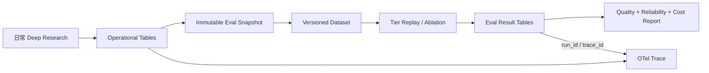

# Deep Research 可观测与 Eval：面试讲解手册

> 适用方向：Agent 开发、LLM 应用、AI 平台、后端架构。  
> 项目路径：`/Users/admin/study/deep-research/backend-python`。  
> 本文只讲四件事：做了什么、为什么这样做、数据怎么落库、面试官会怎么追问。

## 1. 先讲清楚项目定位

这是一个多 Agent Deep Research 系统，支持 MEDIUM、HIGH、ULTRA 三档：

```text
MEDIUM：单轮研究 + 单 ReportAgent
HIGH：单轮研究 + comparative/data-driven 双 Draft + Synthesis
ULTRA：多轮研究 + 多 Lens Reviewer + 章节团队 + 可选 ClaimVerifier
```

这个项目最难的不是“调用一次大模型”，而是一次请求包含多 Agent、并发搜索、动态决策、降级、恢复和长报告合成。系统即使返回了报告，也可能存在：

- 某个关键阶段失败后静默 fallback。
- Reviewer 判断继续，但预算实现导致第二轮根本没有执行。
- 引用存在，但引用并不支持对应 Claim。
- ULTRA 消耗数倍 Token，质量却没有显著提升。
- 同一个 Research 经历 HITL、Resume 或 Retry，运行数据混在一起。

所以我把问题拆成三个层次：

```text
可观测：这次执行发生了什么？为什么走到这个结果？
落库：能否保留可复现、可审计、可关联的运行事实？
Eval：最终报告是否真的好？昂贵机制是否真的有效？
```

## 2. 面试开场怎么说

### 2.1 60 秒版本

> 我在这个 Deep Research 项目里主要做了两类工作。第一类是可观测性：我没有只记录模型耗时，而是按工作流语义建模 Trace，把 Scope、Supervisor、Researcher、Reviewer、多轮决策和报告章节团队串成一条因果链，并补充 Agent 角色、轮次、预算、Reviewer 投票、报告质量门和 fallback 信息。这个改造还暴露了 ULTRA 多轮预算的真实问题：原来 6 个任务既是单轮上限又是总上限，第一轮用完后 Reviewer 即使要求继续也无法进入第二轮。我把它拆成每轮预算和总预算，并解决跨轮 Task ID 与 Context FS 覆盖问题。
>
> 第二类是 Eval 体系设计：我把“工作流完成”和“报告质量好”分开，用 Hard Gate、Claim-Citation 事实核验、题目覆盖度、来源质量、分析深度和成本收益评价报告；同时设计同题三档回放和机制消融，判断 HIGH 双 Draft、ULTRA Reviewer、多轮和章节团队是否值得额外 Token。为了让 Eval 可复现，我进一步设计了 Research/Run、版本快照、Artifact、阶段 Token、Source Snapshot 和 Claim-Citation Manifest 的落库模型。当前可观测和 ULTRA 预算修复已经进入代码，Eval 数据模型与 Runner 是下一阶段按 MVP v2 实施的内容。

### 2.2 一句话总结

> 可观测负责记录真实执行过程，Eval 负责独立判断结果质量，落库层把两者连接成可复现、可审计的质量闭环。

## 3. 我在可观测上做了什么

### 3.1 从“模型调用树”升级为“业务工作流 Trace”

原来即使能看到模型调用，也很难回答它属于哪个 Agent、哪一轮、为什么继续研究，以及报告在哪个阶段发生了降级。

我按业务阶段建立 Trace：

```text
deep_research.workflow
├─ ScopeAgent
├─ SupervisorAgent
├─ ResearcherAgent × N
├─ UltraDynamicReview
│  └─ Reviewer × Lens
├─ ReportSectionTeam
│  ├─ ReportSectionPlanner
│  ├─ ReportSectionDraft × N
│  ├─ ReportConsistency
│  ├─ ReportSectionRevise × N
│  └─ ReportMerge
└─ UltraReportGate
```

业务 Span 表达“工作流在做什么”，底层 Model/Tool Span 表达“物理调用发生了什么”。二者使用同一个 OTel 上下文，保持父子因果关系。

### 3.2 补充 Agent、轮次和预算语义

公共属性包括：

```text
research.id
agent.name
agent.stage
workflow.mode
workflow.status
dynamic.round.no
budget.level
budget.conduct.per_round_limit
budget.conduct.total_limit
budget.conduct.round_used
budget.conduct.total_used
gen_ai.usage.input_tokens
gen_ai.usage.output_tokens
```

这使我可以回答：

- 哪个 Agent 最慢、最贵、最容易失败。
- ULTRA 当前处于第几轮。
- 当前轮用了多少任务，整个研究还剩多少任务预算。
- 第二轮是否真的发生，而不是只在 Reviewer 文本中说要继续。

### 3.3 Reviewer 决策白盒化

Reviewer 不再只留下一个自然语言结论，而是记录：

```text
review.next.action
review.continue.votes
review.report.votes
review.total.votes
review.continue.threshold
review.consensus
review.gaps.count
review.score.coverage
review.score.evidence
review.score.freshness
review.score.sourceDiversity
review.score.consistency
```

Trace 保存低基数的决策摘要；完整 Gap、Rationale 和 Evidence 仍进入数据库，避免高基数正文污染 Trace。

### 3.4 报告团队和质量门可见

ULTRA 报告阶段拆成 Planner、Section Draft、Consistency、Revision 和 Merge，并记录章节 ID、章节数量、弱章节数、阻塞 Gap 和最终质量状态：

```text
report.quality.status = ready | needs_disclosure
report.weak.sections.count
report.blocking.gaps.count
```

这样可以区分：

```text
技术完成：流程没有抛出未处理异常
降级完成：某机制失败，但 fallback 仍返回报告
质量完成：外部 Eval 通过事实和覆盖度 Gate
```

### 3.5 可观测改造发现并修复了什么

我发现 ULTRA 原来的 `maxConductCount=6` 同时表示：

```text
每轮最多规划 6 个任务
整个 Workflow 最多执行 6 个任务
```

第一轮用满 6 个任务后，即使 Reviewer 判断 `continue`，总预算也已经耗尽，多轮流程实际退化成单轮。

修复后：

```text
maxConductCount       = 每轮任务上限
maxTotalConductCount  = 整次研究总任务上限

复杂 ULTRA：6/轮，12/总量
fact_lookup：3/轮，3/总量
```

同时完成：

- `conduct_count` 每轮重置，`total_conduct_count` 跨轮累计。
- 跨轮 Task/Worker ID 加入 Round，避免 ID 冲突。
- Context FS Branch 使用 Round 偏移，避免第二轮覆盖第一轮 Source/Evidence。
- Trace 同时记录单轮预算与总预算。

这个案例最能体现可观测的价值：它不仅用于看 Dashboard，还用于发现“接口成功但核心机制没有真正执行”的静默失效。

### 3.6 当前可观测的边界

已经实现：

- 工作流、阶段、模型和工具的 Trace 因果链。
- Agent 角色、工作流模式、动态轮次和研究预算。
- Reviewer 投票、评分、Gap 数和继续/报告决策。
- 报告章节团队和质量门的阶段级可见性。
- ULTRA 每轮/总任务预算及跨轮隔离。

仍需补齐：

- `run.id/run.attempt/run.trigger/run.outcome` 的稳定语义。
- 所有 fallback、捕获异常和业务失败对 Span Status 的准确映射。
- 去除手工 Model Span 与 AgentScope 原生 Span 的潜在 Token 重复。
- Stage、Round、Reviewer Lens、Report Phase、Section 级 Token 持久化和总量对账。
- Metrics、结构化 Logs、Collector、采样和 Telemetry 自监控。
- Git/Prompt/Template/请求模型与响应模型的自动版本快照。

## 4. 落库怎么设计

### 4.1 先区分 Research 和 Run

```text
Research：用户视角的一次研究任务，research_id 长期不变。
Run：后端一次连续执行尝试，run_id 每次执行唯一。
```

同一个 Research 可能有多个 Run：

```text
Research R1
├─ Run A：initial，执行到 HITL，outcome=hitl_wait
├─ Run B：hitl_resume，恢复后失败，outcome=failed
└─ Run C：retry，最终完成，outcome=success
```

如果不拆 Run，Eval 无法判断报告、Token、Trace 和错误属于哪次尝试，也无法计算恢复成功率。

### 4.2 三层数据模型



三层职责：

1. Operational Tables：保存日常研究真实执行事实。
2. Eval Snapshot Tables：冻结、脱敏、版本化评价输入。
3. Eval Result Tables：保存 Experiment、Case、Metric、Judge 原因和成本。

Eval 不长期直接 Join 可变业务表，否则网页变化、消息更新和重跑会破坏可复现性。

### 4.3 已有数据可以复用什么

| 已有数据 | 用途 |
|---|---|
| `research_session` | Research 状态、档位、模型、总 Token、开始结束时间 |
| `chat_message` | 用户问题和最终报告 |
| `workflow_event` | 阶段、错误和部分 fallback 事件 |
| `research_planning_round` | ULTRA 轮次目标和摘要 |
| `research_work_item` | 每轮研究任务与结果 |
| `research_decision_log` | Reviewer 决策、投票、Gap Payload |
| `research_evidence_ledger` | URL、来源类型、证据强度和 Snippet |
| `research_context_node` | Source、Evidence、Draft、Section 等 Context FS 内容 |
| OTel Trace | Agent/Model/Tool 因果链、部分 Token 和时延 |

这些数据足够做一次粗粒度报告检查，但不足以做稳定的跨版本回归和机制归因。

### 4.4 MVP 新增的核心表

| 表 | 解决的问题 |
|---|---|
| `research_run` | 区分 Initial、HITL Resume、Checkpoint Resume、Retry、Eval Replay |
| `research_artifact` | 冻结 Query、Brief、Source、Evidence、Draft、Synthesis、Final |
| `research_llm_call` | 一个物理 LLM 调用一条 Token 事实，使用 `llm_call_id` 去重 |
| `research_stage_usage` | 按 Stage/Agent/Round/Report Phase/Lens/Section 聚合成本 |
| `research_claim_manifest` | 将最终报告 Claim 连接到 Citation、Source Snapshot、Evidence |
| `eval_dataset_item` | 保存脱敏后的真实问题、Required Points、Reference Facts、时间边界 |
| `eval_experiment` | 保存三档比较或机制消融的版本和配置 |
| `eval_case_run` | 保存某道题、某个 Variant、某次重复运行的结果 |
| `eval_score` | 保存 Metric、分数、Gate、Judge 版本、原因和明细 |

### 4.5 Artifact 保存什么

所有档位保存：

```text
user_query
research_brief
source_snapshot
evidence_item
report_final
```

HIGH 额外保存：

```text
report_draft/comparative
report_draft/data-driven
report_synthesis/high
```

ULTRA 额外保存：

```text
round_review
report_section_draft
report_section_revision
report_merged/ultra
claim_verifier output
```

每个 Artifact 至少记录：

```text
research_id / run_id
artifact_type / stage / round / section / angle
content 或 content_ref
content_sha256
request_model / response_model
prompt_version / prompt_sha256
input_tokens / output_tokens / duration
outcome / fallback_used
```

大正文进入对象存储，数据库保存引用和 Hash；MVP 可先用 MEDIUMTEXT，但必须有大小上限。

### 4.6 Claim-Citation Manifest 是什么

它是最终报告的结构化事实索引，不是展示给用户的另一份报告：

```text
claim_id
claim_text
section_id
importance
requires_citation
citation_marker / citation_url
source_snapshot_id
evidence_id / evidence_excerpt
```

它解决五个问题：

- 哪些应引用 Claim 没有引用。
- 引用是否真正支持 Claim。
- 关键 Claim 是否被多来源交叉验证。
- HIGH Synthesis 是否丢失了 Draft 中的重要 Claim/Citation。
- ULTRA Merge/Revision 是否引入了新但无证据的事实。

MVP 由异步 Claim Extractor 从 Markdown 生成；长期由 Report Agent 输出 Manifest，外部 Eval 独立验证，避免自己证明自己。

### 4.7 版本怎么保存

每个 Run 创建时自动冻结：

```text
workflow_commit_sha + workflow_dirty
各 Agent 的 prompt_version + prompt_sha256
template_version + template_sha256
request_model + response_model
evaluator_version + judge_prompt_hash + judge_model
```

部署环境优先注入 Git SHA，本地开发才读取 `.git`。版本采集失败写明确的 `unknown` 并告警，不能静默为空。

### 4.8 当前落库实现状态

面试时必须如实表达：

> 当前业务运行表、ULTRA Planning/Decision/Evidence/Context FS 已经存在；Research/Run、不可变 Eval Snapshot、阶段 Token、Claim Manifest 和 Eval Result 表已经完成详细设计，正在按 MVP v2 分阶段实现。`Base.metadata.create_all()` 只能创建新表，不能修改存量表，所以落地时会同时更新 SQLAlchemy Model、初始化 SQL，并提供显式迁移 SQL。

不要把设计中的表描述成已经上线。

## 5. 我在 Eval 上做了什么

### 5.1 先重新定义“可靠性”

普通服务常把成功率定义为 HTTP 200，但 Deep Research 至少有三种成功：

```text
technical_success：工作流执行完成
task_success：报告通过任务要求和质量 Gate
reliable_success：在可接受成本和时延下稳定通过质量 Gate
```

核心指标是：

```text
task_success_rate = 通过质量 Gate 的 Run / 全部 Run
cost_per_pass = 总成本 / 通过质量 Gate 的 Run
```

### 5.2 报告质量如何评价

我使用 Hard Gate 加多维指标，而不是一个可以互相抵消的总分。

Hard Gate：

```text
workflow_completed
report_non_empty
citation_parse_rate = 1
citation_traceability >= 0.95
unsupported_critical_claim_count = 0
contradicted_critical_claim_count = 0
no_sensitive_data_leak = true
```

MVP 核心 12 项指标：

```text
required_point_coverage
critical_fact_recall
claim_factuality
citation_completeness
citation_correctness
effective_citation_count
source_quality
source_freshness
analysis_depth
multi_source_synthesis
uncertainty_calibration
instruction_following
```

原则是：关键事实错误不能被结构、文采或篇幅高分抵消。

### 5.3 开放式任务没有唯一答案怎么办

不使用文本相似度评价长报告，而是为每个 Dataset Item 定义：

```text
required_points
critical_reference_facts
forbidden_claims
source_policy
as_of_date
task_specific_rubric
```

报告措辞和结构可以不同，但必须覆盖核心问题、满足关键事实和来源要求。

### 5.4 为什么要做 Claim 级评价

一篇报告有很多引用，不代表每个关键结论都有依据。因此把报告拆成 Atomic Claim，并评价：

```text
supported
partially_supported
unsupported
contradicted
not_verifiable
```

Claim 按重要性加权：

```text
critical = 3
major = 2
minor = 1
```

然后计算 Citation Completeness、Citation Correctness 和 Claim Factuality。确定性 Parser 负责引用格式、悬空引用和 URL 追溯；LLM Judge 只处理语义支持关系，降低成本和随机性。

### 5.5 三个档位不能用线上均值直接比较

生产环境存在选择偏差：简单问题更可能选 MEDIUM，复杂问题更可能选 ULTRA。因此：

```text
线上 ULTRA 平均分 > MEDIUM 平均分
```

不能证明 ULTRA 更好。

正确方法是：

1. 从日常研究中分层抽样真实问题。
2. 脱敏并冻结为同一个 Dataset Item。
3. 固定模型、时间边界和 Source Policy。
4. 同一道题分别回放 MEDIUM、HIGH、ULTRA。
5. 比较 Case 级配对质量差、Token 差和时延差。

首版选 6 道题，覆盖事实检索、技术比较、市场分析、学术综述、趋势预测和证据冲突。`6 × 3 = 18 Runs` 只用于打通闭环和方向性判断，不宣称统计显著性。

### 5.6 三档分别评什么

共同标准：最终报告质量、事实安全底线、成本、时延、失败和 fallback。

MEDIUM：

- 在小预算下能否覆盖核心问题。
- 单 ReportAgent 是否出现明显漏答或不支持 Claim。
- 是否适合作为简单任务的成本基线。

HIGH：

- comparative 与 data-driven Draft 是否真的互补。
- Synthesis 是否优于最佳单 Draft。
- Synthesis 是否丢失 Claim、Citation 或引入无依据内容。
- 额外 Token 是否带来稳定 Uplift。

ULTRA：

- Reviewer Gap 是否被外部评价确认是真 Gap。
- 第二轮是否关闭 Gap、增加新证据和新 Supported Claim。
- 新一轮是否只是重复搜索和扩写。
- Section Team 是否减少跨章节矛盾。
- Revision/Merge 是否产生信息损失。
- ClaimVerifier 是否降低关键 Unsupported Claim。

### 5.7 如何验证昂贵机制是否有效

做配对消融，而不是只看完整 ULTRA：

```text
HIGH：Single Draft vs Dual Draft + Synthesis
Reviewer：No Reviewer vs Single Reviewer vs Multi-Lens Reviewer
Multi-round：Round 1 Only vs Generic Round 2 vs Gap-directed Round 2
Report：Single ReportAgent vs Section Team
Verifier：Without ClaimVerifier vs With ClaimVerifier
```

每个机制同时报告：

```text
quality_uplift
gate_pass_uplift
incremental_tokens
incremental_duration
marginal_quality_per_1k_tokens
cost_per_pass
失败样本
```

如果成本更高但质量没有提升，该机制被更轻量方案支配；如果只对某类复杂题有效，就用于路由，而不是全量开启。

### 5.8 内部 Reviewer 为什么不能直接当 Eval

Reviewer 是在线控制器，不是真值：

- 可能与生成模型共享偏差。
- 看到的 Evidence 可能本身就是错的。
- Reviewer 评价中间材料，不等于最终报告事实正确。
- 没有人工标注校准。

因此分开记录：

```text
self_review.*  用于在线决策和诊断
eval.*         用于独立质量判断
```

再分析内部自评与外部 Eval 的一致性，发现质量门的假阳性和假阴性。

### 5.9 Eval 数据从哪里来

```text
日常真实研究
→ 异步 Candidate Snapshot
→ 脱敏与合规过滤
→ 分层抽样进入版本化 Dataset
→ 人工补 Required Points/Critical Facts
→ 同题回放三档或机制 Variant
→ Evaluator 打分并关联原 Run/Trace
```

Snapshot 和 Eval 失败不能影响用户的研究状态。不能只收集成功样本，还要覆盖 degraded、failed、cancelled、fallback、needs_disclosure 和负反馈样本。

### 5.10 当前 Eval 实现状态

已经完成：

- Eval 问题定义、指标体系、Hard Gate 和 Claim 级评价方案。
- 三档契约、同题配对设计和机制消融矩阵。
- 真实日常数据进入 Candidate/Dataset 的链路设计。
- Run、Artifact、Source Snapshot、Stage Token、Manifest 和 Eval Result Schema。
- MVP 实施顺序、幂等键、索引、测试矩阵和完成标准。

尚未完成：

- 新表和迁移真正落到数据库。
- 异步 Snapshot Worker。
- Claim Extractor、Citation Judge、Coverage Judge 和 Report Quality Judge。
- 6 题 Dataset v1、18 次三档回放和消融结果。
- Judge 人工校准与发布门禁。

面试表达应是“我完成了体系设计并先补齐可观测和数据基础”，不能说“Eval 平台已经上线”。

## 6. 整体架构如何串起来

```text
用户 Research
→ Run Recorder 创建 run_id/attempt/version snapshot
→ Workflow 执行并产生 Trace
→ LLM Call/Stage Usage 记录成本
→ Source/Evidence/Report Artifact 不可变落库
→ 异步生成 Claim-Citation Manifest 和 Candidate Snapshot
→ Dataset Curator 脱敏、标注、版本化
→ Eval Runner 执行 Tier Replay / Ablation
→ Deterministic Evaluator + LLM Judge
→ Eval Score/Reason/Cost 落库
→ 通过 run_id/trace_id 回到具体失败阶段
```

闭环价值在于：Eval 发现 `citation_correctness` 下降后，不只知道“分数低”，还能定位是哪个 Workflow Version、哪个 Prompt、哪个 Agent、哪一轮、哪个 Report Phase 引入了错误，以及为这个错误花了多少 Token。

## 7. 面试官高概率追问

### 7.1 “怎么判断 Deep Research 结果好坏？”

答：分为 Hard Gate、报告质量、可靠性和效率。Hard Gate 拦截关键事实错误、不可追溯引用和敏感信息泄漏；质量看覆盖度、事实性、引用正确性、来源质量、分析深度和不确定性；可靠性看多次运行通过 Gate 的比例；效率看 Cost per Pass。不能用文采或总分掩盖关键事实错误。

### 7.2 “没有标准答案怎么 Eval？”

答：不用全文相似度。每道题维护 Required Points、Critical Facts、Forbidden Claims、Source Policy 和 as-of-date。输出表达可以不同，但关键事实、覆盖要求和证据约束必须满足。

### 7.3 “为什么引用数量不能代表质量？”

答：引用可能悬空、重复、来源质量差，或者并不支持相邻 Claim。必须把报告拆成 Claim-Citation Pair，分别计算 Citation Completeness 和 Correctness。

### 7.4 “LLM Judge 自己也会错，怎么办？”

答：格式、URL、悬空引用和泄漏先用确定性规则；语义支持关系再用 Judge。Judge Prompt、模型和版本必须冻结；对 Claim-Citation Pair 做人工标注，计算 Precision/Recall/F1，关键错误单独看漏检率。必要时双 Judge 或人工仲裁，但不把多 Judge 当作真值本身。

### 7.5 “线上三档平均分能证明 ULTRA 更好吗？”

答：不能，有选择偏差。要冻结同一道题，固定模型、时间和来源策略，配对回放三档，再比较质量与成本差值。

### 7.6 “ULTRA 为什么不一定更好？”

答：更多轮次可能重复搜索，更多 Agent 可能传播错误，Merge 可能丢失信息，长报告可能只是冗长。必须用 Round Delta、Gap Closure、Novel Evidence、Claim Retention 和 Marginal Quality per 1K Tokens 验证。

### 7.7 “Reviewer 有什么用，如何证明？”

答：Reviewer 的价值不是它给了高分，而是它发现的 Gap 是否被外部 Eval 认为真实，以及下一轮是否关闭 Gap。通过 No Reviewer、Single Reviewer、Multi-Lens Reviewer 的冻结证据消融比较 Uplift 和 Token。

### 7.8 “Research 和 Run 为什么要拆？”

答：Research 是用户任务，Run 是一次连续后台尝试。HITL、Resume、Retry 会让一个 Research 对应多个 Run。不拆就无法准确关联 Trace、版本、Token、Outcome 和某次生成的报告，也无法算恢复成功率。

### 7.9 “Trace 里为什么不直接保存完整 Prompt 和报告？”

答：正文高基数、成本高、存在隐私和泄密风险，也不适合 Metric/Trace 检索。Trace 只放 ID、状态、版本、计数和摘要；完整内容进入有权限、保留周期和 Hash 的 Artifact Store。

### 7.10 “阶段 Token 怎么保证不重复？”

答：底层每个物理模型调用生成唯一 `llm_call_id` 并作为唯一 Token 事实源。上层 Agent、Pipeline 和 OTel 只能引用或聚合，不能再次新增。Stage Usage 定期与 Run 总 Token 对账并记录 Delta。

### 7.11 “为什么需要保存 Source Snapshot，URL 不够吗？”

答：网页会修改、删除或因权限变得不可访问。Eval 必须看到运行时证据，因此保存内容或对象引用、抓取时间和 SHA-256。URL 只负责标识来源，不能保证可复现。

### 7.12 “Eval 为什么不能同步跑在用户请求里？”

答：Claim 抽取和 Judge 成本高、延迟不稳定，而且评价失败不应影响用户任务。正常请求只写运行事实并投递 Snapshot Job，Dataset 和 Judge 在异步链路执行。

### 7.13 “怎么处理版本回归？”

答：每个 Run 冻结 Git、Prompt、Template、请求/响应模型版本；每个 Eval 保存 Evaluator 和 Judge 版本。同一 Dataset 运行新旧版本，通过 Case Pair Difference 判断回归，并用 run_id/trace_id 定位变化发生在哪个阶段。

### 7.14 “你遇到的最有价值的 Bug 是什么？”

答：ULTRA 的单轮任务上限被同时当成整次研究总上限。第一轮把 6 个任务用完后 Reviewer 即使要求继续也无法进入第二轮。通过轮次、预算和 Reviewer 决策的可观测对照发现问题，随后拆分 per-round/total budget，并修复跨轮 Task ID 和 Context FS 覆盖。这说明 Agent 系统要观测业务语义，而不只是接口是否成功。

### 7.15 “如果只能先做一个最小 MVP，你做什么？”

答：先补 Run、版本、不可变 Artifact 和阶段 Token；选 6 道真实脱敏题；实现确定性引用检查、Claim Extractor、Citation/Fact Judge 和 Required Point Judge；同题回放三档；优先做 HIGH 双 Draft、ULTRA 第二轮和 Section Team 三组消融；最后输出 Gate Pass、质量差、Token 差和失败样本。

### 7.16 “这个方案目前最大的不足是什么？”

答：Eval 体系目前主要完成设计，尚缺真实 Dataset 回放结果和 Judge 人工校准；可观测目前偏 Trace，Run 语义、阶段 Token 对账、Metrics/Logs 和 Collector 治理还未完成。这些是明确的下一阶段，而不是隐瞒的缺陷。

## 8. 面试时最容易说错的话

不要说：

```text
接入 Langfuse 就完成了可观测。
Workflow Completed 就代表研究可靠。
Reviewer 给高分，所以报告质量高。
ULTRA 搜索更多，所以一定比 MEDIUM 好。
引用越多，报告越可信。
已经完成 Eval 平台和全部落库。
```

更准确的表达：

```text
我完成了关键业务 Trace 白盒化和 ULTRA 多轮预算修复。
我设计了从日常运行数据到可复现 Eval 的数据模型和 MVP。
当前业务表和 ULTRA Artifact 已存在，新的 Run/Snapshot/Eval 表仍待实施。
最终效果要通过同题配对、机制消融和人工校准证明。
```

## 9. 项目亮点如何写到简历

可以写成：

> 为多 Agent Deep Research 工作流设计业务语义可观测体系，基于 OpenTelemetry 串联 Scope、Supervisor、Researcher、Multi-Lens Reviewer 和 Section Report Team，补充 Agent、轮次、预算、决策与质量门维度；通过 Trace 发现并修复 ULTRA 单轮/总任务预算耦合及跨轮证据覆盖问题，使 Gap-directed 第二轮能够真实执行。

> 设计 Deep Research Eval MVP，以 Hard Gate、Claim-Citation 事实核验、Required-point Coverage、来源质量和成本收益评价报告；规划 Research/Run、不可变 Artifact、Source Snapshot、阶段 Token、Claim Manifest 和 Eval Experiment 落库模型，通过同题三档回放与机制消融评估 Dual Draft、Reviewer、多轮、Section Team 的边际收益。

如果尚未完成 Eval 代码实现，简历中使用“设计”“规划”“推动落地”，不要使用“上线完整 Eval 平台”。

## 10. 最终收口

面试最后可以这样总结：

> 这个项目让我形成的核心认识是，Agent 系统不能只看 HTTP 成功率和模型调用次数。首先要用可观测性还原工作流真实执行，包括动态决策、降级、预算和中间产物；然后用不可变数据和版本快照保证 Eval 可复现；最后通过 Claim 级事实核验、同题配对和机制消融判断结果是否可信、复杂机制是否值得成本。可观测告诉我问题发生在哪里，Eval 告诉我它是否影响用户结果，落库把这两个问题连接起来。
