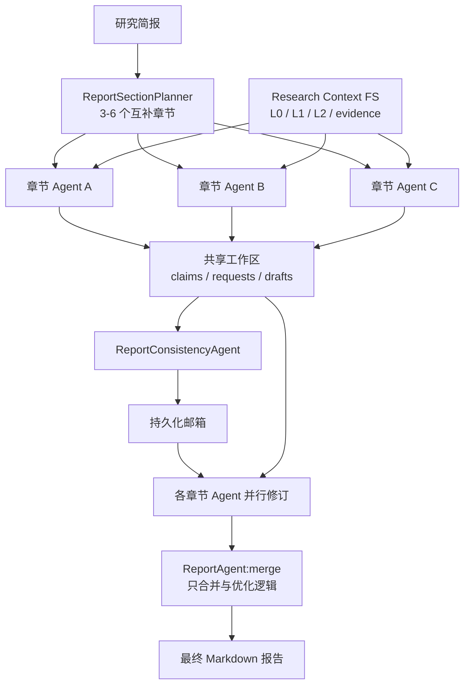

# 章节多 Agent 报告团队

本文档说明报告生成如何利用 Research Context FS 的 L0/L1/L2 三层上下文，由多个章节 Agent 并行撰写、交换声明与证据，再由主 ReportAgent 完成合并。

## 设计目标

原报告链路会把按章节检索的 L0/L1 上下文统一装配给一个 ReportAgent，L2 原文虽然已经持久化，但未真正进入报告生成。新链路的目标是：

- 先用 L0 广泛召回，再用 L1 精排，数字、时间、引用、冲突或证据稀薄时按 `parent_path` 定向读取 L2。
- 每个章节由独立 Agent 负责证据组织和章节撰写，避免所有原文同时进入单次 Prompt。
- 章节 Agent 通过共享声明和持久化邮箱交换可复用信息、证据请求和冲突修订要求。
- 一致性 Agent 专门检查跨章节数字、时间、术语、重复和结论边界。
- 主 ReportAgent 只合并、消重、统一术语和优化逻辑，不重新研究，也不引入章节中不存在的事实。

## 总体流程



`ReportSectionTeam.run()` 的阶段顺序为：

1. `ReportSectionPlanner` 根据研究简报动态规划 3–6 个章节；规划失败时使用内置五章结构。
2. 章节 Agent 并行装配证据、生成初稿、发布共享声明和章节间请求。
3. `ReportConsistencyAgent` 读取所有初稿、共享声明与请求，生成定向邮箱消息。
4. 每个章节 Agent 读取其他章节的共享声明和自己的邮箱，并行生成修订稿。
5. `ReportAgent:merge` 仅接收修订后章节，合并为最终报告。

## L0/L1/L2 读取策略

每个章节独立执行上下文选择：

```text
研究简报 + 章节标题 + 章节目标 + 证据要求
  ↓
L0 source_abstract 广泛召回（最多 12 个）
  ↓ parent_path
L1 source_overview 精排（最多 6 个）
  ↓
derived evidence / branch_summary 排序（最多 10 个）
  ↓
需要数字、比例、时间、引用、冲突、风险、规模、对比，或结构化证据少于 3 条
  ↓
对相关 L1 的 parent_path 读取 L2 raw.txt 摘录
```

L2 读取使用 `ResearchContextStore.read_raw_for_parent()`。单来源摘录默认上限由 `RESEARCH_CONTEXT_RAW_EXCERPT_MAX_CHARS=1200` 控制。这个限制是单来源的 Prompt 安全边界，不影响 L2 节点在 Context FS 中按 `RESEARCH_CONTEXT_L2_MAX_CHARS` 持久化。

## 共享工作区

所有中间产物使用现有 `research_context_node` 表持久化，无需新增数据表。逻辑路径为：

```text
research://{research_id}/report/workspace/
├── plan.json
├── shared/
│   └── claims/
│       └── claim-{hash}.json
├── mailboxes/
│   └── {section_id}/
│       └── msg-{hash}.json
├── sections/
│   └── {section_id}/
│       ├── evidence.json
│       ├── draft.md
│       └── revision.md
└── final.md
```

对应节点类型：

| 节点类型 | 用途 |
|---|---|
| `report_plan` | 章节规划 |
| `report_section_evidence` | 章节选中的 L0/L1/L2/derived 证据快照 |
| `report_section_draft` | 章节初稿 |
| `report_shared_claim` | 可被其他章节复用的带来源声明 |
| `report_agent_message` | 章节邮箱消息 |
| `report_section_revision` | 交叉检查后的章节修订稿 |
| `report_context` | 最终报告快照 |

## Agent 通信协议

当前通信为“持久化邮箱 + 有界交互阶段”，不是无限制 Agent 自由聊天。这样可以恢复、审计，也避免通信死循环。

已支持的消息类型：

- `evidence_request`：章节 Agent 向指定章节请求核实或补充证据。
- `evidence_response`：一致性 Agent 路由可复用证据。
- `conflict_detected`：数字、时间、主体或结论冲突。
- `terminology_update`：统一术语或口径。
- `section_dependency`：一个章节需要显式引用其他章节的结论或限制。
- `review_request`：通用的跨章节复核要求。

每条消息包含 `from_agent`、`to_agent`、`message_type`、`subject`、`instruction`、`related_claim_ids` 和 `status`。章节修订 Agent 仅读取发给自己的邮箱消息。

## 启用、兼容与降级

工作流模板的 `report.sectionTeamEnabled` 控制新链路：

```json
{
  "report": {
    "sectionTeamEnabled": true,
    "claimVerification": true
  }
}
```

- 仓库内六个 Ultra 模板默认为 `true`。
- 无模板或老会话缺少该字段时默认为 `false`，保持旧链路兼容。
- 章节团队任一阶段抛出异常时，`ReportAgent` 发布错误事件并回退原 Ultra 多角度起草/评审/融合流程。
- REST、SSE、MySQL 表结构和最终 assistant message 协议不变。
- 逻辑并行仍受模型账户 semaphore 和已有 LLM 并发/重试配置约束。

## 可观测性

报告团队模型阶段名称：

```text
ReportSectionPlanner
ReportSectionAgent:{section_id}
ReportConsistencyAgent
ReportSectionReviser:{section_id}
ReportAgent:merge
```

`AGENT_RUNTIME` 事件会记录：

- 报告团队启动及章节数；
- 每个章节的共享声明数和 L2 来源数；
- 交叉通信完成后的消息数。

详细证据和通信内容可以通过 `research://{research_id}/report/workspace/` 节点审计。

## 测试

```bash
cd backend-python
conda run -n deep-research-py python -m compileall -q app tests
conda run -n deep-research-py pytest -q \
  tests/test_report_team.py \
  tests/test_report_context.py \
  tests/test_ultra_dynamic_online.py
```

`tests/test_report_team.py` 验证：

- 章节规划、并行初稿、一致性检查、并行修订和最终合并的调用顺序；
- L2 `raw.txt` 真正进入章节证据快照；
- `evidence_request` 邮箱消息和修订稿持久化；
- 最终报告写入 `report/workspace/final.md`；
- 新链路必须由模板显式启用。

## 当前边界

- 通信是“初稿 → 一致性路由 → 修订”的单个有界往返，不是常驻 Agent 的无限多轮聊天。
- L2 是按相关 L1 的 `parent_path` 定向读取摘录，不会将全部 L2 原文不加选择地塞入 Prompt。
- 共享工作区已持久化，但当前异常恢复仍以整个 ReportAgent 阶段回退为主，尚未从单个章节修订节点续跑。
