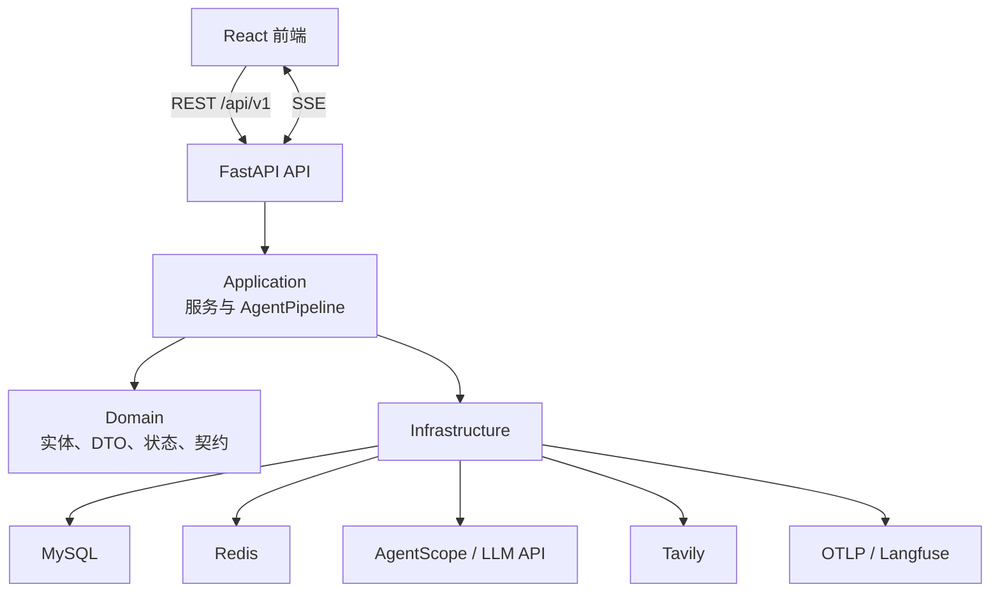

# 架构设计

## 系统边界

前端通过 REST 管理用户、模型和研究会话，通过 SSE 接收研究时间线与报告流。FastAPI 后端负责鉴权、任务排队、Agent 编排和持久化；MySQL 保存业务数据，Redis 保存时间线、断线重放索引和 HITL checkpoint。

## 模块职责

| 模块 | 职责 |
|---|---|
| `api` | 路由、请求依赖、响应封装 |
| `application` | 用户/模型/研究用例，Agent 与工作流编排 |
| `domain` | ORM 实体、DTO、研究状态、Agent 调用契约 |
| `infrastructure` | 数据库、Redis、SSE、LLM、搜索、追踪 |
| `core` | 配置、认证、异常和通用工具 |

## 研究执行

`ResearchTaskQueue` 使用有界 `asyncio.Queue` 和固定 worker 数控制后台任务。`AgentPipeline` 维护状态机并依次执行 Scope、Supervisor、Report。Supervisor 将研究主题拆成独立子任务，根据预算并发运行 Researcher；SearchAgent 负责搜索与网页压缩。

所有阶段共享 `DeepResearchState`，其中保存预算计数、研究材料、状态、token 用量和 trace 元数据。状态变化持久化到 `research_session`，消息和工作流事件分别持久化到 `chat_message`、`workflow_event`。

