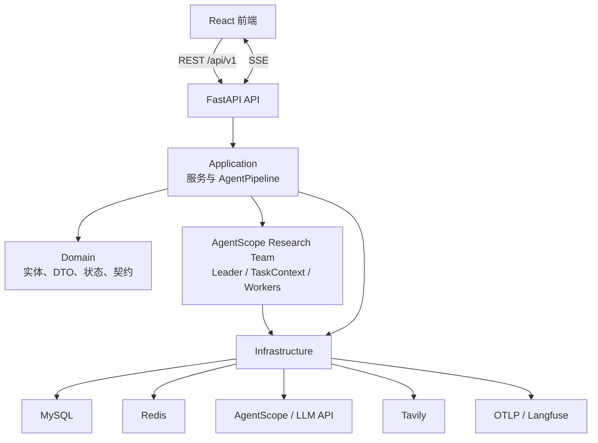

# 架构设计

## 系统边界

前端通过 REST 管理用户、模型和研究会话，通过 SSE 接收研究时间线与报告流。FastAPI 后端负责鉴权、任务排队、Agent 编排和持久化；MySQL 保存业务数据，Redis 保存时间线、断线重放索引和 HITL checkpoint。

```mermaid
flowchart TB
    FE["React 前端"] -->|"REST /api/v1"| API["FastAPI API"]
    API --> APP["Application<br/>服务与 AgentPipeline"]
    APP --> DOMAIN["Domain<br/>实体、DTO、状态、契约"]
    APP --> TEAM["AgentScope Research Team<br/>Leader / TaskContext / Workers"]
    TEAM --> INFRA["Infrastructure"]
    APP --> INFRA
    INFRA --> MYSQL["MySQL"]
    INFRA --> REDIS["Redis"]
    INFRA --> LLM["AgentScope / LLM API"]
    INFRA --> TAVILY["Tavily"]
    INFRA --> OTLP["OTLP / Langfuse"]
    API <-->|"SSE"| FE
```

## 模块职责

| 模块 | 职责 |
|---|---|
| `api` | 路由、请求依赖、响应封装 |
| `application` | 用户/模型/研究用例，Agent 与工作流编排 |
| `domain` | ORM 实体、DTO、研究状态、Agent 调用契约 |
| `infrastructure` | 数据库、Redis、SSE、LLM、搜索、追踪 |
| `core` | 配置、认证、异常和通用工具 |

## 研究执行

`ResearchTaskQueue` 使用有界 `asyncio.Queue` 和固定 worker 数控制后台任务。`AgentPipeline` 是薄的持久业务协调器，维护 Scope、HITL、Research、Report 状态和 checkpoint。认知阶段由每研究会话的 AgentScope runtime session 执行。

Supervisor Leader 生成任务后写入 AgentScope `TaskContext`，`AgentScopeResearchTeam` 为每个任务分配稳定 Worker ID；Worker 拥有隔离 `AgentState`，按 `maxConcurrentUnits` 并发运行。AgentScope Middleware 采集 reply、reasoning、model、tool 生命周期，Event Bridge 将摘要转换为兼容的 `AGENT_RUNTIME` workflow event。

`AgentScopeResearchTeam` 在执行边界发布团队启动与完成事件。主时间线只呈现这类团队生命周期和业务阶段，避免低层 `SearchAgent runtime completed` 淹没用户信息；完整 Agent、model、tool 与 Task 事件仍保留在 API 和右侧 Agent Flow，并按 stage/worker 聚合展示。

`DeepResearchState` 保存业务状态、预算、研究材料、token 和 runtime snapshot；AgentScope `AgentState` 保存运行上下文和原生任务。MySQL/Redis 仍是业务事实来源，AgentScope 状态只负责运行时，避免框架会话模型侵入现有 API 和数据结构。
